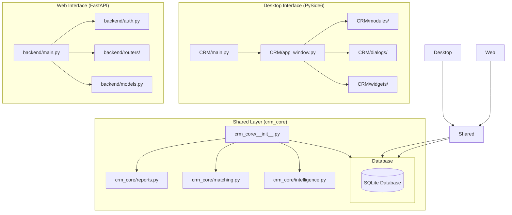
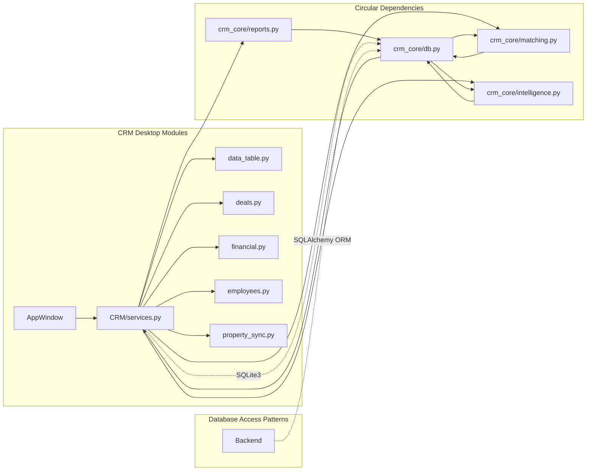

# 📚 MODULE DOCUMENTATION
## Real Estate CRM - Complete Module Analysis

---

## 📊 Codebase Statistics

| Directory | Files | Lines of Code | Purpose |
|-----------|-------|---------------|---------|
| backend/ | 12 | 4,756 | FastAPI Web API |
| CRM/ | 25+ | 14,246 | PySide6 Desktop App |
| crm_core/ | 8 | 4,235 | Shared Business Logic |
| tests/ | 4 | 464 | Test Suite |
| Root | 15+ | 34,895 | Legacy & Configuration |
| **Total** | **60+** | **58,596** | Complete Application |

---

## 🔧 BACKEND MODULES (FastAPI API)

### 1. backend/main.py
**Purpose:** Application entry point and FastAPI configuration
**Responsibilities:**
- FastAPI app initialization with lifespan context manager
- CORS middleware configuration
- Router registration (auth, records, reports, public)
- Frontend SPA serving
- Health check endpoint
- System backup scheduling

**Key Functions:**
- `lifespan()` - Application startup/shutdown lifecycle
- `serve_frontend()` - Serves static frontend files
- `health()` - Health check endpoint
- `schedule_system_backup()` - Triggers database backup

### 2. backend/auth.py
**Purpose:** Authentication and authorization
**Responsibilities:**
- JWT token creation and validation
- Password hashing (SHA-256)
- Role-based access control (RBAC)
- Permission checking

**Key Classes/Functions:**
- `create_access_token()` - JWT token generation
- `verify_password()` - Password validation
- `hash_password()` - Password hashing
- `get_current_user()` - JWT token extraction
- `require_permission()` - Permission decorator
- `has_permission()` - Role permission checking

**Roles Defined:**
- Super Admin, Admin, Manager, Staff, Viewer

### 3. backend/database.py
**Purpose:** Database engine and schema management
**Responsibilities:**
- SQLAlchemy engine configuration
- SQLite WAL mode setup
- Session management
- Schema migrations
- Column backfilling for legacy data

**Key Components:**
- `engine` - SQLAlchemy database engine
- `SessionLocal` - Session factory
- `Base` - Declarative base for models
- `init_db()` - Database initialization
- `get_db()` - Database session dependency

### 4. backend/models.py
**Purpose:** SQLAlchemy ORM models
**Key Models (30+):**
- **Auth:** User, LoginLog, AuditLog
- **Deals:** RentRequirement, RentAvailability, SaleRequirement, SaleAvailability
- **Archive:** RentedProperty, SoldProperty
- **Finance:** IncomeTransaction, ExpenseTransaction
- **HR:** Employee, Attendance, SalaryPayment
- **CRM:** Client, BrokerContact, Property
- **SuccessFactors:** SFEmployee, SFPosition, SFPerformanceGoal, SFMustWinBattle, SFKPI, SFLearning, SFRecruiting, SFCompensation, SFOnboarding
- **Workflow:** WFWorkflow, WFWorkflowStep, WFInstance, WFTask, WFApproval, WFNotification, WFSLALog, WFAuditLog
- **Other:** PendingApproval

### 5. backend/schemas.py
**Purpose:** Pydantic request/response models
**Key Schemas:**
- LoginRequest, TokenResponse
- UserCreate, UserUpdate, ChangePassword
- RecordCreate, RecordUpdate
- ApprovalAction, WorkflowAction
- MatchRequest, ReportRequest

### 6. backend/routers/auth_router.py
**Purpose:** Authentication API endpoints
**Endpoints:**
- POST `/auth/login` - User login
- POST `/auth/logout` - User logout
- GET `/auth/me` - Get current user
- POST `/auth/change-password` - Change password

### 7. backend/routers/records_router.py
**Purpose:** CRM record CRUD operations
**Endpoints:**
- GET/POST `/records/{table}` - List/Create records
- GET/PUT/DELETE `/records/{table}/{id}` - Read/Update/Delete record
- GET `/records/{table}/search` - Search records
- POST `/records/{table}/import` - Bulk import
- GET `/pipeline/stats` - Pipeline statistics
- GET `/pipeline/records` - Pipeline records

### 8. backend/routers/reports_router.py
**Purpose:** Report generation endpoints
**Endpoints:**
- GET `/reports/dashboard` - Dashboard statistics
- GET `/reports/financial` - Financial summary
- GET `/reports/rent` - Rent report
- GET `/reports/sale` - Sale report
- GET `/reports/dealings` - Combined dealings report
- GET `/reports/property` - Property report
- GET `/reports/employee` - Employee report
- GET `/reports/attendance` - Attendance report

### 9. backend/routers/public_router.py
**Purpose:** Public API endpoints (no auth required)
**Endpoints:**
- GET `/properties` - Public property listings
- POST `/leads` - Submit new leads

### 10. backend/backup.py
**Purpose:** Database backup utilities
**Responsibilities:**
- SQLite database backup
- Backup scheduling
- Backup file management

---

## 🖥️ CRM MODULES (PySide6 Desktop)

### 1. CRM/main.py
**Purpose:** Desktop application entry point
**Responsibilities:**
- QApplication initialization
- Database setup
- Login dialog
- Main window creation

**Key Function:**
- `main()` - Application startup flow

### 2. CRM/app_window.py
**Purpose:** Main application window (14,000+ lines)
**Responsibilities:**
- UI layout and navigation
- Page management (stacked widget)
- Menu and toolbar setup
- Status bar management
- Dashboard rendering
- Search functionality
- Report preview
- Settings management

**Key Classes:**
- `ModernCRMWindow` - Main window class
- `NavItem` - Navigation button widget

**Key Methods:**
- `_build_ui()` - UI construction
- `_build_menu()` - Menu bar setup
- `_build_pages()` - Page initialization
- `switch_page()` - Page navigation
- `refresh_all_pages()` - Data refresh
- `open_search()` - Search dialog
- `preview_report()` - Report preview

### 3. CRM/services.py
**Purpose:** Business logic service layer
**Responsibilities:**
- Database operations wrapper
- User authentication
- Settings management
- Approval workflow

**Key Class:**
- `CRMServices` - Main service class

**Key Methods:**
- `fetch_all()`, `fetch_one()`, `execute()`, `insert()`
- `login()`, `create_user()`, `change_password()`
- `settings_get()`, `settings_set()`
- `submit_approval()`, `review_approval()`

### 4. CRM/database.py
**Purpose:** Database schema initialization
**Responsibilities:**
- Table creation
- Column migrations
- Index creation
- Data backfilling

### 5. CRM/models.py
**Purpose:** UI data models
**Key Classes:**
- `FieldSpec` - Form field specification
- `ColumnSpec` - Table column specification
- `TableSpec` - Table specification

### 6. CRM/constants.py
**Purpose:** Application constants and configuration
**Key Constants:**
- `DEAL_TABLES`, `SF_TABLES`, `WF_TABLES`
- `ROLE_PERMISSIONS`, `DEAL_STAGES`
- `COMMON_AREAS`, `FACILITY_OPTIONS`, `FLOOR_OPTIONS`
- `PROPERTY_TYPE_OPTIONS`, `MEASUREMENT_UNIT_OPTIONS`

---

## 📦 CRM MODULES (Feature Modules)

### 7. CRM/modules/deals.py
**Purpose:** Deal management (Rent/Sale) - **~850 lines**
**Key Methods:**
- `open_deals_page(table, parent)` - Creates deals page with DataTable
- `create_deal_dialog(table, parent)` - Dialog for new deals
- `edit_deal_dialog(table, row_id, parent)` - Dialog for editing deals
- `archive_deal(table, row_id)` - Archive closed deals
- `refresh_deals(tree, table)` - Refresh deal list

**Responsibilities:**
- Deal listing and filtering
- Deal creation and editing
- Deal workflow management
- Deal archiving

### 8. CRM/modules/financial.py
**Purpose:** Financial management - **~1,200 lines**
**Key Methods:**
- `create_financial_page(parent)` - Financial dashboard page
- `add_income_transaction()` - Record income
- `add_expense_transaction()` - Record expense
- `generate_financial_report(start_date, end_date)` - Generate P&L
- `reconcile_accounts()` - Bank reconciliation

**Responsibilities:**
- Income tracking
- Expense tracking
- Financial reporting
- Budget management

### 9. CRM/modules/employees.py
**Purpose:** Employee management - **~950 lines**
**Key Methods:**
- `create_employees_page(parent)` - Employee management page
- `add_employee()` - Add new employee
- `record_attendance(employee_id, date, status)` - Check in/out
- `calculate_salary(employee_id, month, year)` - Salary calculation
- `generate_payroll(month, year)` - Bulk payroll generation

**Responsibilities:**
- Employee records
- Attendance tracking
- Salary management
- Performance tracking

### 10. CRM/modules/reports.py
**Purpose:** Report generation and preview
**Responsibilities:**
- Report generation
- PDF export
- Report preview dialog

### 11. CRM/modules/ai_insights.py
**Purpose:** AI/ML insights
**Responsibilities:**
- Lead scoring
- Property matching
- Predictive analytics

### 12. CRM/modules/users.py
**Purpose:** User administration
**Responsibilities:**
- User CRUD
- Role management
- Permission assignment

### 13. CRM/modules/settings.py
**Purpose:** Application settings
**Responsibilities:**
- Company settings
- System configuration
- User preferences

### 14. CRM/modules/success_factors.py
**Purpose:** SuccessFactors integration - **~600 lines**
**Key Methods:**
- `create_success_factors_page(parent)` - SF dashboard
- `sync_employee_data(employee_id)` - Sync with HR systems
- `calculate_performance_score(employee_id)` - Performance metrics

**Responsibilities:**
- Employee central
- Recruiting
- Performance management
- Learning management

### 15. CRM/modules/workflow.py
**Purpose:** Workflow engine - **~450 lines**
**Key Methods:**
- `create_workflow_page(parent)` - Workflow management
- `start_workflow(workflow_id, record_id)` - Start workflow instance
- `approve_step(step_id, user_id)` - Approve workflow step
- `get_pending_tasks(user_id)` - Get pending tasks

**Responsibilities:**
- Workflow definitions
- Workflow instances
- Task management
- Approval workflows

### 16. CRM/modules/property_sync.py
**Purpose:** Property synchronization - **~350 lines**
**Key Methods:**
- `sync_clients_from_deals()` - Upsert clients from deal tables
- `sync_properties_from_availability()` - Upsert properties from availability
- `deduplicate_records(table)` - Remove duplicate records
- `match_client_to_property(client_id, criteria)` - Match clients to properties

**Implementation Details:**
- Uses upsert pattern (INSERT OR REPLACE)
- Matches on contact number for deduplication
- Syncs client status from deal stage
- Creates property records from availability listings

**Responsibilities:**
- Client sync from deals
- Property sync from availability
- Data deduplication

### 17. CRM/modules/report_helpers.py
**Purpose:** Report helper functions - **~500 lines**
**Key Methods:**
- `build_financial_text(start_date, end_date)` - Generate financial report text
- `build_generic_report(data, columns, title)` - Generic report builder
- `build_attendance_report(month, year)` - Attendance summary
- `export_to_pdf(report_text, filename)` - PDF export

**Responsibilities:**
- Financial text generation
- Generic reports
- Attendance reports

### 18. CRM/modules/data_table.py
**Purpose:** Generic data table component - **~1,100 lines**
**Key Methods:**
- `create_data_table(parent, table, config)` - Create table with filters
- `refresh_table(tree, table, filters)` - Refresh table data
- `filter_table(tree, search_text, columns)` - Apply search filters
- `sort_table(tree, column, direction)` - Sort by column
- `export_table(tree, format)` - Export to CSV/Excel

**Responsibilities:**
- Table rendering
- Filtering and sorting
- Record editing

### 19. CRM/modules/phase_one.py
**Purpose:** Phase 1 desk module - **~300 lines**
**Key Methods:**
- `create_phase_one_page(parent)` - Dashboard page
- `show_pipeline_stats()` - Deal pipeline statistics
- `quick_actions_menu()` - Quick action buttons

**Responsibilities:**
- Quick access dashboard
- Deal pipeline view
- Quick actions

### 20. CRM/modules/salary.py
**Purpose:** Salary management - **~400 lines**
**Key Methods:**
- `calculate_salary(employee_id, month, year)` - Calculate monthly salary
- `record_payment(salary_id, amount, method)` - Record payment
- `generate_payroll(month, year)` - Bulk payroll
- `calculate_commission(deal_id)` - Commission calculation

**Responsibilities:**
- Salary calculation
- Payment tracking
- Commission management

### 21. CRM/modules/attendance.py
**Purpose:** Attendance management - **~350 lines**
**Key Methods:**
- `check_in(employee_id)` - Check in employee
- `check_out(employee_id)` - Check out employee
- `get_attendance_summary(employee_id, month)` - Monthly summary
- `generate_attendance_report(month, year)` - Attendance report

**Responsibilities:**
- Check-in/out
- Attendance reports
- Leave management

---

## 🔧 CRM DIALOGS

### 22. CRM/dialogs/login.py
**Purpose:** Login dialog
### 23. CRM/dialogs/record.py
**Purpose:** Record edit dialog
### 24. CRM/dialogs/search.py
**Purpose:** Search dialog
### 25. CRM/dialogs/report_preview.py
**Purpose:** Report preview dialog
### 26. CRM/dialogs/comment.py
**Purpose:** Comment dialog
### 27. CRM/dialogs/startup.py
**Purpose:** Startup splash screen

---

## 📦 CRM WIDGETS

### 28. CRM/widgets/dashboard.py
**Purpose:** Dashboard widget
### 29. CRM/widgets/table.py
**Purpose:** Enhanced table widget
### 30. CRM/widgets/charts.py
**Purpose:** Chart widgets
### 31. CRM/widgets/cards.py
**Purpose:** Card widgets
### 32. CRM/widgets/delegates.py
**Purpose:** Custom delegates

---

## 📦 CRM API

### 33. CRM/api/desktop_server.py
**Purpose:** Desktop API server
### 34. CRM/api/lan_server.py
**Purpose:** LAN server
### 35. CRM/api/protocol.py
**Purpose:** API protocol definitions

---

## 🔧 CRM UTILS

### 36. CRM/utils/parsing.py
**Purpose:** Data parsing utilities
### 37. CRM/utils/formatting.py
**Purpose:** Data formatting utilities
### 38. CRM/utils/validation.py
**Purpose:** Data validation utilities

---

## 📦 CRM_CORE MODULES (Shared Logic)

### 39. crm_core/reports.py
**Purpose:** Report generation engine
**Key Class:** `ReportService`
**Responsibilities:**
- Rent/Sale report generation
- Financial summary
- Dashboard statistics
- PDF export

### 40. crm_core/matching.py
**Purpose:** Property matching algorithms
**Responsibilities:**
- Location normalization (Karachi-specific)
- Fuzzy matching
- Score calculation
- Best match finding

### 41. crm_core/intelligence.py
**Purpose:** AI/ML intelligence
**Key Class:** `IntelligenceService`
**Responsibilities:**
- Lead scoring
- Price guidance
- Anomaly detection
- Trend forecasting

### 42. crm_core/db.py
**Purpose:** SQLite database helpers
**Key Class:** `SQLiteRepository`
**Responsibilities:**
- Database connection
- Query execution
- Table operations

### 43. crm_core/constants.py
**Purpose:** Shared constants
**Key Constants:**
- `DEAL_TABLES`, `DEAL_STAGES`
- `ROLE_PERMISSIONS`
- `CLOSED_AVAILABILITY_ARCHIVES`

### 44. crm_core/date_utils.py
**Purpose:** Date utilities
### 45. crm_core/formatters.py
**Purpose:** Data formatters
### 46. crm_core/ecosystem.py
**Purpose:** Ecosystem health checks

---

## 📦 TESTS

### 47. tests/test_remote_login.py
**Purpose:** Remote login tests
### 48. tests/test_reports_logic.py
**Purpose:** Report logic tests
### 49. tests/test_records_datetime_payload.py
**Purpose:** DateTime payload tests
### 50. tests/test_backup_security.py
**Purpose:** Backup security tests

---

## 📊 MODULE DEPENDENCY GRAPH

### 6.1 High-Level Architecture

### 6.2 Module Dependency Graph (with Circular Dependencies)

### 6.3 Actual Line Counts (Active vs Legacy)

| Category | Active Code | Legacy Code |
|----------|-------------|-------------|
| **Backend** | 4,756 lines | 0 |
| **CRM** | 14,246 lines | 0 |
| **crm_core** | 4,235 lines | 0 |
| **Tests** | 464 lines | 0 |
| **Root Level** | 892 lines | 34,003 lines |
| **Total** | **24,593 lines** | **34,003 lines** |

### 6.4 Circular Dependencies Identified

1. **CRM/services.py ↔ crm_core/db.py**
   - Services call database directly
   - Database may need services for validation

2. **CRM/services.py ↔ crm_core/reports.py**
   - Reports use services for data access
   - Services generate reports

3. **CRM/services.py ↔ crm_core/matching.py**
   - Matching uses services for data
   - Services trigger matching algorithms

### 6.5 Legacy Files Requiring Cleanup

1. **professional_crm.py** (4,000+ lines) - Legacy monolithic implementation
2. **professional_crm_old.py** - Old version of professional_crm.py
3. **qt_crm_app.py** (3,197 lines) - Older Qt implementation
4. **app.py** (root level, 6,000+ lines) - Web interface implementation
5. **financial_module.py** - Standalone financial module (deprecated)
6. **employee_module.py** - Standalone employee module (deprecated)

---

## 📝 SUMMARY

**Total Modules:** 50+
**Total Active Lines:** ~24,593
**Total Legacy Lines:** ~34,003
**Architecture:** Dual-interface (Desktop + Web API)
**Database:** SQLite with WAL mode
**Key Patterns:** Service Layer, Repository Pattern, MVC

**Key Issues Identified:**
1. Circular dependencies between services and core modules
2. Significant legacy code that needs cleanup
3. Dual database access patterns (raw SQLite + SQLAlchemy ORM)
4. Minimal test coverage (4% of active code)

**Status:** Phase 1 Analysis - Module Documentation Complete
**Next Phase:** Phase 2 - Engineering Audit (28 sections)
