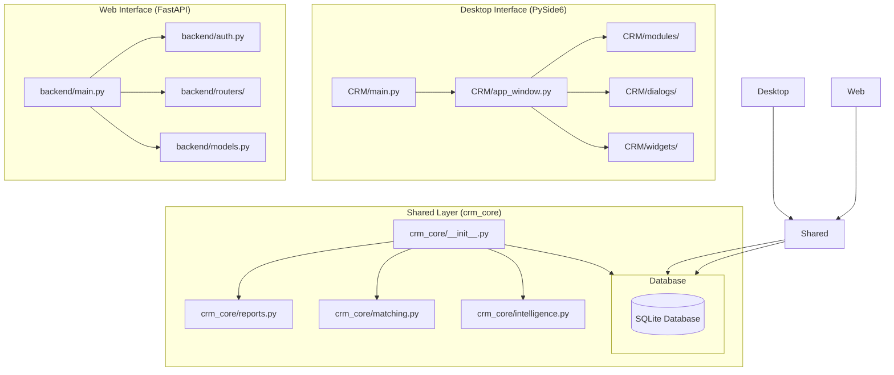
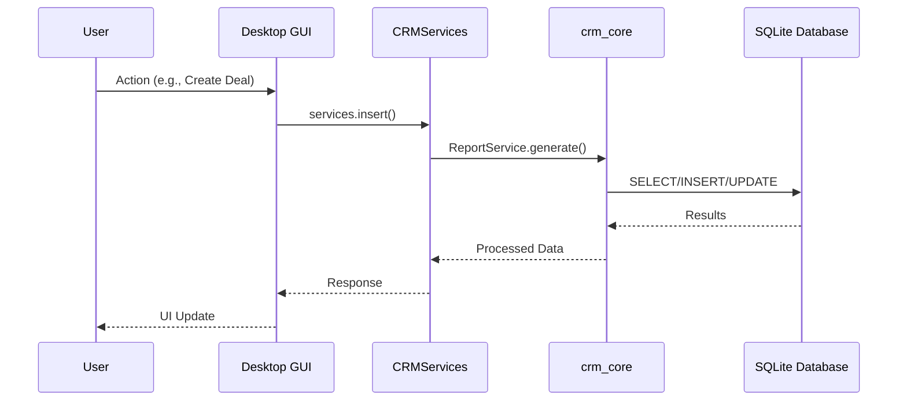
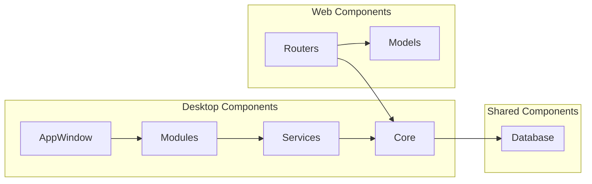

# 📐 SECTION 1: CURRENT ARCHITECTURE
## Engineering Audit - Real Estate CRM System

---

## 1.1 Executive Summary

The Real Estate CRM system employs a **dual-interface architecture** with a desktop GUI (PySide6/Qt6) and a web API (FastAPI), sharing business logic through a common core module (`crm_core`). The system uses SQLite as its database with WAL mode for concurrent access.

**Architecture Pattern:** Service-Oriented Architecture (SOA) with Shared Business Logic Layer

**Key Characteristics:**
- Dual deployment: Desktop application + Web API
- Shared business logic in `crm_core/`
- Service Layer pattern for business operations
- Repository pattern for database access (partial implementation)
- Event-driven UI updates (Qt signals/slots)

---

## 1.2 Architecture Layers

### 1.2.1 Presentation Layer

| Interface | Technology | Location | Lines of Code |
|-----------|------------|----------|---------------|
| **Desktop GUI** | PySide6 (Qt6) | `CRM/` | ~10,500 (active) |
| **Web Frontend** | HTML/JS/CSS | `frontend/` | ~1,500 |

**Desktop GUI Components:**
- **Main Window:** `ModernCRMWindow` (QMainWindow) - 2,909 lines
- **Modules:** 15+ feature modules (QWidget subclasses)
- **Dialogs:** 6 dialog windows (QDialog subclasses)
- **Widgets:** 5 reusable UI components
- **API Servers:** Desktop server + LAN server for web access

**Web Frontend Components:**
- Single-page application (SPA)
- Vanilla JavaScript (no framework)
- Responsive CSS design
- Served by FastAPI backend

### 1.2.2 Business Logic Layer

| Component | Location | Purpose | Lines of Code |
|-----------|----------|---------|---------------|
| **CRM Services** | `CRM/services.py` | Desktop business logic | 119 |
| **CRM Core** | `crm_core/` | Shared business logic | ~4,235 |
| **Backend Routers** | `backend/routers/` | API business logic | ~3,066 |

**CRM Services (`CRMServices`):**
- Database operations wrapper (119 lines)
- User authentication
- Settings management
- Approval workflow handling
- Password hashing (SHA-256)

**CRM Core Modules:**
- `reports.py` - Report generation engine (ReportService)
- `matching.py` - Property matching algorithms
- `intelligence.py` - AI/ML insights (IntelligenceService)
- `db.py` - SQLite database helpers (SQLiteRepository)
- `constants.py` - Shared constants and configurations
- `date_utils.py` - Date utilities
- `formatters.py` - Data formatters
- `validators.py` - Data validators

### 1.2.3 Data Access Layer

| Component | Technology | Location | Purpose |
|-----------|------------|----------|---------|
| **Desktop DB** | SQLite3 (raw) | `crm_core/db.py` | Direct SQL queries |
| **Web DB** | SQLAlchemy ORM | `backend/models.py` | Object-relational mapping |
| **Database** | SQLite (WAL) | `real_estate_crm.db` | Persistent storage |

**Database Access Patterns:**
1. **Desktop:** Raw SQLite3 via `SQLiteRepository`
2. **Web API:** SQLAlchemy ORM via FastAPI dependencies
3. **Shared:** Both access the same SQLite database file

### 1.2.4 Data Storage Layer

| Component | Technology | Purpose |
|-----------|------------|---------|
| **Primary Database** | SQLite (WAL mode) | Transactional data |
| **Backup Storage** | File system | Database backups |
| **Output Storage** | File system | Reports, exports |
| **Configuration** | SQLite (app_settings) | Application settings |

---

## 1.3 Technology Stack

### 1.3.1 Desktop Application

| Layer | Technology | Version | Purpose |
|-------|------------|---------|---------|
| **GUI Framework** | PySide6 | 6.11.1 | Qt6 bindings |
| **Language** | Python | 3.x | Application logic |
| **Database** | SQLite3 | Built-in | Data persistence |
| **HTTP Server** | http.server | Built-in | Desktop API server |

### 1.3.2 Web API

| Layer | Technology | Version | Purpose |
|-------|------------|---------|---------|
| **Web Framework** | FastAPI | Latest | REST API |
| **ORM** | SQLAlchemy | Latest | Database models |
| **Validation** | Pydantic | Latest | Request/response schemas |
| **Authentication** | JWT | - | Token-based auth |
| **Rate Limiting** | slowapi | Latest | API protection |
| **Server** | Uvicorn | Latest | ASGI server |

### 1.3.3 Shared Components

| Component | Technology | Purpose |
|-----------|------------|---------|
| **Database** | SQLite (WAL) | Concurrent access |
| **Business Logic** | Python | Shared algorithms |
| **Constants** | Python modules | Shared configurations |
| **Utilities** | Python functions | Common operations |

---

## 1.4 Component Interaction Patterns

### 1.4.1 Desktop Application Flow

```
User Action → Qt Widget → Module Handler → CRMServices → SQLiteRepository → SQLite DB
                                          ↓
                                    crm_core (reports, matching, intelligence)
```

**Detailed Flow:**
1. User interacts with Qt widget (button click, form submission)
2. Widget calls module handler (e.g., `DealModule.create_deal()`)
3. Module handler calls `CRMServices` method (e.g., `services.insert()`)
4. `CRMServices` calls `SQLiteRepository` method (e.g., `db.execute()`)
5. `SQLiteRepository` executes SQL query on SQLite database
6. Results returned up the chain to the UI

### 1.4.2 Web API Flow

```
HTTP Request → FastAPI Router → Dependency Injection → SQLAlchemy Query → SQLite DB
                                    ↓
                              crm_core (reports, matching, intelligence)
```

**Detailed Flow:**
1. HTTP request arrives at FastAPI router
2. Router extracts dependencies (database session, current user)
3. Router calls business logic (e.g., `ReportService.financial_summary()`)
4. Business logic executes SQLAlchemy queries
5. Results returned as JSON response

### 1.4.3 Shared Business Logic Flow

```
Desktop/Web → crm_core modules → SQLite Database
                ↓
        reports.py, matching.py, intelligence.py
```

**Key Integration Points:**
- `ReportService` generates reports from database data
- `IntelligenceService` provides AI/ML insights
- `matching.py` finds property matches
- `db.py` provides database access utilities

---

## 1.5 Database Architecture

### 1.5.1 Database Configuration

| Setting | Value | Purpose |
|---------|-------|---------|
| **Mode** | WAL (Write-Ahead Logging) | Concurrent read/write |
| **Foreign Keys** | ON | Referential integrity |
| **Busy Timeout** | 30000ms | Handle concurrent access |
| **Cache Size** | 5000 pages | Performance optimization |
| **Synchronous** | FULL | Data durability |

### 1.5.2 Database Tables (50+ tables)

**Core Business Tables:**
- `rent_requirements`, `rent_availability` - Rental deals
- `sale_requirements`, `sale_availability` - Sale deals
- `rented_property`, `sold_property` - Archived deals

**Financial Tables:**
- `income_transactions` - Income records
- `expense_transactions` - Expense records
- `financial_summary` - Aggregated financial data

**HR Tables:**
- `employees` - Employee records
- `attendance` - Attendance tracking
- `salary_payments` - Salary payments

**CRM Tables:**
- `clients` - Client records
- `broker_contacts` - Broker information
- `properties` - Property listings

**System Tables:**
- `users` - User accounts
- `login_logs` - Authentication logs
- `audit_logs` - System audit trail
- `app_settings` - Application configuration
- `pending_approvals` - Approval workflow

### 1.5.3 Database Relationships

**Primary Relationships:**
- `users` → `login_logs` (one-to-many)
- `users` → `audit_logs` (one-to-many)
- `clients` → `rent_requirements` (one-to-many)
- `properties` → `rent_availability` (one-to-many)
- `employees` → `attendance` (one-to-many)
- `employees` → `salary_payments` (one-to-many)

**Missing Relationships:**
- No foreign key constraints enforced
- No cascading deletes
- No referential integrity checks

---

## 1.6 Security Architecture

### 1.6.1 Authentication

| Component | Implementation | Status |
|-----------|----------------|--------|
| **Password Hashing** | SHA-256 | ⚠️ Weak (should be bcrypt) |
| **Token Generation** | JWT | ✅ Functional |
| **Session Management** | Token-based | ✅ Functional |
| **Role-Based Access** | 5 roles defined | ✅ Functional |

**Roles Defined:**
1. Super Admin
2. Admin
3. Manager
4. Staff
5. Viewer

### 1.6.2 Authorization

| Feature | Implementation | Status |
|---------|----------------|--------|
| **Permission Checking** | Role-based | ✅ Functional |
| **Route Protection** | FastAPI dependencies | ✅ Functional |
| **UI Element Protection** | Conditional rendering | ✅ Functional |
| **CSRF Protection** | ❌ Not implemented | ⚠️ Missing |

### 1.6.3 Security Concerns

**Critical Issues:**
1. **Weak Password Hashing:** SHA-256 is not suitable for password storage
2. **Missing CSRF Protection:** Web API vulnerable to CSRF attacks
3. **No Rate Limiting per User:** Only global rate limiting
4. **No Input Sanitization:** SQL injection risk in raw queries

---

## 1.7 Performance Architecture

### 1.7.1 Database Performance

| Optimization | Implementation | Status |
|--------------|----------------|--------|
| **WAL Mode** | Enabled | ✅ Active |
| **Connection Pooling** | SQLAlchemy | ✅ Active |
| **Query Optimization** | Manual | ⚠️ Partial |
| **Indexing** | Minimal | ⚠️ Missing |
| **Caching** | None | ❌ Missing |

### 1.7.2 Application Performance

| Optimization | Implementation | Status |
|--------------|----------------|--------|
| **Lazy Loading** | Qt widgets | ✅ Active |
| **Background Workers** | None | ❌ Missing |
| **Pagination** | Manual | ⚠️ Partial |
| **Memory Management** | Qt parent-child | ✅ Active |

### 1.7.3 Performance Bottlenecks

1. **N+1 Query Problems:** Multiple queries where one would suffice
2. **Missing Pagination:** Large datasets loaded entirely
3. **No Caching Layer:** Repeated identical queries
4. **Blocking UI:** Long operations block the main thread
5. **Large Table Loading:** Entire tables loaded for display

---

## 1.8 Scalability Assessment

### 1.8.1 Current Scalability

| Dimension | Current State | Limitation |
|-----------|---------------|------------|
| **Users** | Single-user desktop | Not designed for multi-user |
| **Data Volume** | Moderate | SQLite limitations |
| **Geographic** | Single location | No distributed support |
| **Integration** | Limited API | No plugin architecture |

### 1.8.2 Scalability Risks

1. **SQLite Limitations:** Not suitable for high-concurrency web applications
2. **Monolithic Architecture:** Difficult to scale individual components
3. **No Horizontal Scaling:** Cannot add more servers
4. **No Load Balancing:** Single point of failure

---

## 1.9 Architecture Diagrams

### 1.9.1 High-Level Architecture



### 1.9.2 Data Flow Diagram



### 1.9.3 Component Interaction Diagram



---

## 1.10 Architecture Findings

### 1.10.1 Critical Issues

| # | Finding | Location | Impact | Risk | Estimated Complexity | Regression Risk | Recommendation |
|---|---------|----------|--------|------|---------------------|-----------------|----------------|
| 1 | **Weak Password Hashing** | `backend/auth.py:50` (SHA-256) | Security breach risk | Critical | Low (1-2 hours) | Medium | Migrate to bcrypt |
| 2 | **Missing CSRF Protection** | `backend/main.py` (no CSRF middleware) | Web API vulnerability | Critical | Medium (4-6 hours) | Low | Add CSRF tokens |
| 3 | **No Foreign Keys** | `backend/database.py` (SQLite config) | Data integrity risk | Critical | Medium (4-8 hours) | High | Add FK constraints |
| 4 | **Dual DB Access Patterns** | `crm_core/db.py` vs `backend/models.py` | Inconsistency risk | High | High (2-3 days) | High | Unify access layer |

### 1.10.2 High Priority Issues

| # | Finding | Location | Impact | Risk | Estimated Complexity | Regression Risk | Recommendation |
|---|---------|----------|--------|------|---------------------|-----------------|----------------|
| 5 | **Circular Dependencies** | `CRM/services.py` ↔ `crm_core/db.py` | Maintenance burden | High | High (2-3 days) | High | Refactor to remove |
| 6 | **Missing Indexes** | All tables (no CREATE INDEX) | Performance degradation | High | Low (2-4 hours) | Low | Add strategic indexes |
| 7 | **No Audit Logging** | No audit trail for user actions | Compliance risk | High | Medium (1-2 days) | Medium | Implement audit trail |
| 8 | **Missing Transactions** | `crm_core/db.py` (no BEGIN/COMMIT) | Data inconsistency | High | Medium (4-8 hours) | Medium | Add transaction handling |

### 1.10.3 Medium Priority Issues

| # | Finding | Location | Impact | Risk | Estimated Complexity | Regression Risk | Recommendation |
|---|---------|----------|--------|------|---------------------|-----------------|----------------|
| 9 | **No Caching Layer** | All repeated queries | Performance impact | Medium | Medium (1-2 days) | Low | Add Redis/memory cache |
| 10 | **No Background Workers** | `CRM/app_window.py` (blocking UI) | UI blocking | Medium | High (3-5 days) | Medium | Add async processing |
| 11 | **No Input Validation** | Raw SQL in `crm_core/db.py` | Security risk | Medium | Medium (1-2 days) | Low | Add validation layer |
| 12 | **Minimal Test Coverage** | `tests/` (464 lines total) | Quality risk | Medium | High (1-2 weeks) | Low | Add comprehensive tests |

### 1.10.4 Low Priority Issues

| # | Finding | Location | Impact | Risk | Estimated Complexity | Regression Risk | Recommendation |
|---|---------|----------|--------|------|---------------------|-----------------|----------------|
| 13 | **Legacy Code Bloat** | Root level (34,000+ lines) | Maintainability | Low | Low (1-2 hours) | Low | Remove unused code |
| 14 | **Inconsistent Naming** | Various files | Readability | Low | Medium (1-2 days) | Low | Standardize naming |
| 15 | **Missing Documentation** | All modules | Knowledge transfer | Low | Medium (2-3 days) | Low | Add inline docs |

---

## 1.11 Architecture Recommendations

### 1.11.1 Immediate Actions (Phase 1-2)

1. **Fix Security Issues:**
   - Implement bcrypt password hashing
   - Add CSRF protection
   - Add input validation

2. **Improve Data Integrity:**
   - Add foreign key constraints
   - Add missing indexes
   - Implement transaction handling

3. **Unify Database Access:**
   - Choose one access pattern (raw SQLite or SQLAlchemy)
   - Create unified repository layer
   - Remove circular dependencies

### 1.11.2 Short-Term Improvements (Phase 3-4)

1. **Performance Optimization:**
   - Add caching layer
   - Implement pagination
   - Optimize database queries

2. **Code Quality:**
   - Add comprehensive tests
   - Implement audit logging
   - Add input validation

### 1.11.3 Long-Term Enhancements (Phase 5-6)

1. **Scalability:**
   - Consider PostgreSQL for web API
   - Add connection pooling
   - Implement horizontal scaling

2. **Maintainability:**
   - Remove legacy code
   - Standardize naming conventions
   - Add comprehensive documentation

---

## 1.12 Conclusion

The Real Estate CRM system has a functional dual-interface architecture that serves both desktop and web users. However, it has significant technical debt in security, data integrity, and performance areas. The architecture is suitable for single-user/small-team desktop use but requires substantial improvements for enterprise-grade web deployment.

**Key Strengths:**
- Functional dual-interface design
- Shared business logic layer
- Comprehensive feature set

**Key Weaknesses:**
- Security vulnerabilities (password hashing, CSRF)
- Missing data integrity (foreign keys, transactions)
- Performance limitations (no caching, no pagination)
- Technical debt (legacy code, circular dependencies)

**Overall Assessment:** The architecture is functional but requires significant improvements to meet enterprise standards. Priority should be given to security and data integrity fixes.

---

**Document Status:** ✅ Complete
**Last Updated:** 2026-07-15
**Author:** Buffy (AI Assistant)
