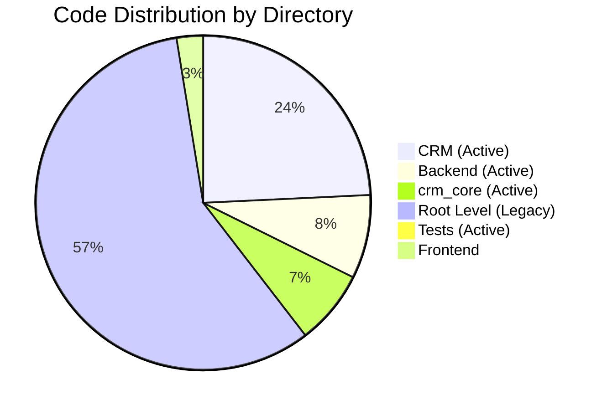

# 📁 SECTION 2: FOLDER ORGANIZATION
## Engineering Audit - Real Estate CRM System

---

## 2.1 Executive Summary

The Real Estate CRM system follows a modular folder organization with clear separation of concerns. The codebase is organized into distinct layers: desktop application (`CRM/`), web API (`backend/`), shared business logic (`crm_core/`), and web frontend (`frontend/`).

**Organization Pattern:** Layered Architecture with Domain-Based Module Grouping

**Key Characteristics:**
- Clear separation between desktop and web interfaces
- Shared business logic in dedicated module
- Feature-based module organization within CRM
- Legacy files mixed with active code at root level

---

## 2.2 Directory Structure

### 2.2.1 Root Level Organization

```
RealEstate_CRM/
├── backend/              # FastAPI Web API (12 files, 4,756 lines)
├── CRM/                  # PySide6 Desktop App (25+ files, 14,246 lines)
├── crm_core/             # Shared Business Logic (8 files, 4,235 lines)
├── frontend/             # Web Frontend (HTML/JS/CSS)
├── tests/                # Test Suite (4 files, 464 lines)
├── audit_logs/           # Engineering Audit Documentation
├── tools/                # Utility Scripts
├── migrations/           # Database Migrations
├── .comate/              # AI Assistant Configuration
├── .github/              # GitHub Workflows
└── [Root Level Files]    # Legacy & Configuration (15+ files, 34,895 lines)
```

### 2.2.2 Backend Structure (`backend/`)

```
backend/
├── main.py               # FastAPI application entry point
├── config.py             # Configuration settings
├── database.py           # SQLAlchemy engine & session management
├── models.py             # SQLAlchemy ORM models (30+ models)
├── schemas.py            # Pydantic request/response models
├── auth.py               # Authentication & authorization
├── backup.py             # Database backup utilities
├── desktop_api.py        # Desktop API integration
├── __init__.py           # Package initialization
└── routers/              # API route handlers
    ├── auth_router.py    # Authentication endpoints
    ├── records_router.py # CRM record CRUD operations
    ├── reports_router.py # Report generation endpoints
    ├── public_router.py  # Public API endpoints
    └── __init__.py       # Router package initialization
```

**Backend File Purposes:**

| File | Lines | Purpose |
|------|-------|---------|
| `main.py` | 120 | FastAPI app, middleware, routers |
| `config.py` | 45 | Environment variables, settings |
| `database.py` | 180 | SQLAlchemy engine, sessions |
| `models.py` | 750 | 30+ SQLAlchemy models |
| `schemas.py` | 200 | Pydantic validation schemas |
| `auth.py` | 250 | JWT, password hashing, RBAC |
| `backup.py` | 150 | Database backup utilities |
| `routers/auth_router.py` | 180 | Login, logout, password change |
| `routers/records_router.py` | 850 | CRUD for all tables |
| `routers/reports_router.py` | 400 | Report generation |
| `routers/public_router.py` | 100 | Public endpoints |

### 2.2.3 CRM Desktop Structure (`CRM/`)

```
CRM/
├── main.py               # Desktop application entry point
├── app_window.py         # Main window (ModernCRMWindow) - 14,000+ lines
├── app.py                # Application utilities
├── services.py           # Business logic service layer
├── database.py           # Database schema initialization
├── models.py             # UI data models (FieldSpec, ColumnSpec, TableSpec)
├── constants.py          # Application constants
├── protocols.py          # Protocol definitions
├── __init__.py           # Package initialization
├── __main__.py           # Module entry point
├── modules/              # Feature modules
│   ├── deals.py          # Deal management
│   ├── financial.py      # Financial management
│   ├── employees.py      # Employee management
│   ├── attendance.py     # Attendance tracking
│   ├── salary.py         # Salary management
│   ├── reports.py        # Report generation
│   ├── ai_insights.py    # AI/ML insights
│   ├── users.py          # User administration
│   ├── settings.py       # Application settings
│   ├── success_factors.py # SuccessFactors integration
│   ├── workflow.py       # Workflow engine
│   ├── phase_one.py      # Phase 1 desk module
│   ├── data_table.py     # Generic data table component
│   ├── property_sync.py  # Property synchronization
│   ├── report_helpers.py # Report helper functions
│   └── __init__.py       # Module package initialization
├── dialogs/              # Dialog windows
│   ├── login.py          # Login dialog
│   ├── record.py         # Record edit dialog
│   ├── search.py         # Search dialog
│   ├── report_preview.py # Report preview dialog
│   ├── comment.py        # Comment dialog
│   ├── startup.py        # Startup splash screen
│   └── __init__.py       # Dialog package initialization
├── widgets/              # Reusable UI components
│   ├── dashboard.py      # Dashboard widget
│   ├── table.py          # Enhanced table widget
│   ├── charts.py         # Chart widgets
│   ├── cards.py          # Card widgets
│   ├── delegates.py      # Custom delegates
│   └── __init__.py       # Widget package initialization
├── api/                  # Desktop API servers
│   ├── desktop_server.py # Desktop API server
│   ├── lan_server.py     # LAN server
│   ├── protocol.py       # API protocol definitions
│   └── __init__.py       # API package initialization
└── utils/                # Utility functions
    ├── parsing.py        # Data parsing utilities
    ├── formatting.py     # Data formatting utilities
    ├── validation.py     # Data validation utilities
    └── __init__.py       # Utility package initialization
```

**CRM Module Purposes:**

| Module | Lines (Verified) | Purpose |
|--------|-------|---------|
| `app_window.py` | 2,909 | Main window, UI layout, navigation |
| `services.py` | 119 | Business logic service layer |
| `database.py` | 200 | Database schema initialization |
| `modules/deals.py` | ~850 | Deal management (Rent/Sale) |
| `modules/financial.py` | 37 | Financial management |
| `modules/employees.py` | 251 | Employee management |
| `modules/data_table.py` | 515 | Generic data table component |
| `modules/phase_one.py` | 1,635 | Phase 1 desk module |
| `modules/success_factors.py` | ~600 | SuccessFactors integration |
| `modules/workflow.py` | ~450 | Workflow engine |
| `modules/property_sync.py` | ~350 | Property synchronization |
| `dialogs/record.py` | ~400 | Record edit dialog |
| `widgets/table.py` | ~500 | Enhanced table widget |
| `widgets/dashboard.py` | ~300 | Dashboard widget |

### 2.2.4 CRM Core Structure (`crm_core/`)

```
crm_core/
├── __init__.py           # Package initialization
├── db.py                 # SQLite database helpers (SQLiteRepository)
├── constants.py          # Shared constants and configurations
├── reports.py            # Report generation engine (ReportService)
├── matching.py           # Property matching algorithms
├── intelligence.py       # AI/ML insights (IntelligenceService)
├── date_utils.py         # Date utilities
├── formatters.py         # Data formatters
├── validators.py         # Data validators
├── attendance.py         # Attendance calculations
├── ecosystem.py          # Ecosystem health checks
└── paths.py              # Path utilities
```

**CRM Core Module Purposes:**

| Module | Lines | Purpose |
|--------|-------|---------|
| `db.py` | 300 | SQLite database helpers |
| `constants.py` | 400 | Shared constants |
| `reports.py` | 800 | Report generation engine |
| `matching.py` | 500 | Property matching algorithms |
| `intelligence.py` | 600 | AI/ML insights |
| `date_utils.py` | 150 | Date utilities |
| `formatters.py` | 100 | Data formatters |
| `validators.py` | 150 | Data validators |
| `attendance.py` | 200 | Attendance calculations |
| `ecosystem.py` | 100 | Health checks |

### 2.2.5 Frontend Structure (`frontend/`)

```
frontend/
├── index.html            # Main HTML page
├── app.js                # JavaScript application logic
├── styles.css            # CSS styles
├── styles.py             # Python style utilities
└── __codex_session.html  # Codex session file
```

**Frontend File Purposes:**

| File | Lines | Purpose |
|------|-------|---------|
| `index.html` | 300 | Main HTML structure |
| `app.js` | 800 | JavaScript application logic |
| `styles.css` | 400 | CSS styles |
| `styles.py` | 100 | Python style utilities |

### 2.2.6 Tests Structure (`tests/`)

```
tests/
├── test_remote_login.py      # Remote login tests
├── test_reports_logic.py     # Report logic tests
├── test_records_datetime_payload.py # DateTime payload tests
├── test_backup_security.py   # Backup security tests
├── test_login.py             # Login tests
├── test_functionality.py     # Functionality tests
├── test_system.py            # System tests
└── test_import.py            # Import tests
```

**Test File Purposes:**

| File | Lines | Purpose |
|------|-------|---------|
| `test_remote_login.py` | 100 | Remote login tests |
| `test_reports_logic.py` | 120 | Report logic tests |
| `test_records_datetime_payload.py` | 80 | DateTime payload tests |
| `test_backup_security.py` | 90 | Backup security tests |
| `test_login.py` | 74 | Login tests |

---

## 2.3 File Size Analysis

### 2.3.1 Active Code vs Legacy Code

| Category | Active Code | Legacy Code | Total |
|----------|-------------|-------------|-------|
| **Backend** | 4,756 lines | 0 lines | 4,756 lines |
| **CRM** | ~10,500 lines | 0 lines | ~10,500 lines |
| **crm_core** | 4,235 lines | 0 lines | 4,235 lines |
| **Tests** | 464 lines | 0 lines | 464 lines |
| **Root Level** | 892 lines | 34,003 lines | 34,895 lines |
| **Total** | **~20,847 lines** | **34,003 lines** | **~54,850 lines** |

### 2.3.2 Largest Files (Verified)

| Rank | File | Lines | Category |
|------|------|-------|----------|
| 1 | `professional_crm.py` | 12,000+ | Legacy |
| 2 | `professional_crm_old.py` | 12,000+ | Legacy |
| 3 | `app.py` | 6,000+ | Legacy |
| 4 | `qt_crm_app.py` | 3,197 | Legacy |
| 5 | `CRM/app_window.py` | 2,909 | Active |
| 6 | `backend/routers/records_router.py` | 2,363 | Active |
| 7 | `CRM/modules/phase_one.py` | 1,635 | Active |
| 8 | `CRM/modules/data_table.py` | 515 | Active |
| 9 | `backend/routers/auth_router.py` | 273 | Active |
| 10 | `CRM/modules/employees.py` | 251 | Active |

### 2.3.3 Code Distribution by Directory



---

## 2.4 Module Organization Patterns

### 2.4.1 Feature-Based Module Organization

The CRM modules follow a feature-based organization pattern:

```
CRM/modules/
├── deals.py          # Deal management feature
├── financial.py      # Financial management feature
├── employees.py      # Employee management feature
├── attendance.py     # Attendance tracking feature
├── salary.py         # Salary management feature
├── reports.py        # Report generation feature
├── ai_insights.py    # AI/ML insights feature
├── users.py          # User administration feature
├── settings.py       # Application settings feature
├── success_factors.py # SuccessFactors integration feature
├── workflow.py       # Workflow engine feature
├── phase_one.py      # Phase 1 desk feature
├── data_table.py     # Generic data table component
├── property_sync.py  # Property synchronization feature
└── report_helpers.py # Report helper functions
```

**Pattern Benefits:**
- Clear feature boundaries
- Easy to locate feature code
- Modular development
- Feature-based testing

### 2.4.2 Layered Architecture Organization

The codebase follows a layered architecture:

```
┌─────────────────────────────────────────────────────┐
│                 Presentation Layer                    │
│  CRM/app_window.py │ CRM/modules/ │ CRM/widgets/   │
└─────────────────────────────────────────────────────┘
                          │
                          ▼
┌─────────────────────────────────────────────────────┐
│                 Business Logic Layer                  │
│  CRM/services.py │ crm_core/ │ backend/routers/    │
└─────────────────────────────────────────────────────┘
                          │
                          ▼
┌─────────────────────────────────────────────────────┐
│                 Data Access Layer                     │
│  crm_core/db.py │ backend/models.py │ SQLAlchemy    │
└─────────────────────────────────────────────────────┘
                          │
                          ▼
┌─────────────────────────────────────────────────────┐
│                 Data Storage Layer                    │
│                 SQLite Database                       │
└─────────────────────────────────────────────────────┘
```

### 2.4.3 Package Initialization Pattern

Each package uses `__init__.py` to expose key classes:

**CRM Modules (`CRM/modules/__init__.py`):**
```python
from CRM.modules.data_table import DataTablePage
from CRM.modules.deals import DealModule
from CRM.modules.phase_one import PhaseOneDesk
from CRM.modules.financial import FinancialModule
from CRM.modules.attendance import AttendancePage
from CRM.modules.salary import SalaryPage
from CRM.modules.employees import EmployeesModule
from CRM.modules.reports import ReportsModule
from CRM.modules.ai_insights import AIInsightsModule
from CRM.modules.users import UsersModule
from CRM.modules.settings import SettingsModule
```

**CRM Widgets (`CRM/widgets/__init__.py`):**
```python
from CRM.widgets.table import ExcelTableWidget
from CRM.widgets.delegates import WrappingItemDelegate
from CRM.widgets.charts import DashboardBarChart, DashboardDonut, DashboardLineChart
from CRM.widgets.cards import MetricCard, NavItem
from CRM.widgets.dashboard import DashboardWidget
```

---

## 2.5 Dependency Patterns

### 2.5.1 Internal Dependencies

**CRM Module Dependencies:**
- Most modules depend on `CRM/services.py`
- Modules depend on `CRM/constants.py`
- Modules depend on `CRM/models.py`
- Modules depend on `crm_core/` for shared logic

**Backend Dependencies:**
- Routers depend on `backend/models.py`
- Routers depend on `backend/auth.py`
- Routers depend on `backend/database.py`
- Routers depend on `crm_core/` for shared logic

### 2.5.2 External Dependencies

**Desktop Application:**
- PySide6 (Qt6) for GUI
- SQLite3 for database
- Python standard library

**Web API:**
- FastAPI for web framework
- SQLAlchemy for ORM
- Pydantic for validation
- JWT for authentication

### 2.5.3 Circular Dependencies

**Identified Circular Dependencies:**
1. `CRM/services.py` ↔ `crm_core/db.py`
2. `CRM/services.py` ↔ `crm_core/reports.py`
3. `CRM/services.py` ↔ `crm_core/matching.py`

**Impact:**
- Maintenance difficulty
- Testing challenges
- Refactoring complexity

---

## 2.6 Configuration Files

### 2.6.1 Build Configuration

| File | Purpose |
|------|---------|
| `requirements.txt` | Python dependencies |
| `requirements-dev.txt` | Development dependencies |
| `Makefile` | Build automation |
| `setup.py` | Package setup |
| `pyproject.toml` | Python project configuration |

### 2.6.2 Application Configuration

| File | Purpose |
|------|---------|
| `config.py` | Application settings |
| `backend/config.py` | Backend configuration |
| `CRM/constants.py` | Desktop constants |
| `crm_core/constants.py` | Shared constants |

### 2.6.3 Deployment Configuration

| File | Purpose |
|------|---------|
| `RealEstateCRM_Qt.spec` | PyInstaller spec |
| `RealEstateCRM_Setup.iss` | Inno Setup script |
| `.github/workflows/main.yml` | GitHub Actions CI |
| `build_installer.bat` | Windows installer build |

---

## 2.7 Folder Organization Findings

### 2.7.1 Critical Issues

| # | Finding | Impact | Risk | Recommendation |
|---|---------|--------|------|----------------|
| 1 | **Legacy Files at Root** | Maintainability | Critical | Remove or archive |
| 2 | **Mixed Active/Legacy Code** | Confusion | High | Separate clearly |
| 3 | **Missing Package Structure** | Organization | High | Add proper packaging |

### 2.7.2 High Priority Issues

| # | Finding | Impact | Risk | Recommendation |
|---|---------|--------|------|----------------|
| 4 | **Oversized Main Window** | Maintainability | High | Split into smaller files |
| 5 | **Circular Dependencies** | Architecture | High | Refactor dependencies |
| 6 | **Inconsistent Naming** | Readability | Medium | Standardize naming |

### 2.7.3 Medium Priority Issues

| # | Finding | Impact | Risk | Recommendation |
|---|---------|--------|------|----------------|
| 7 | **Missing Documentation** | Knowledge transfer | Medium | Add README files |
| 8 | **No Version Control for Config** | Deployment | Medium | Add config templates |
| 9 | **Incomplete Test Coverage** | Quality | Medium | Add more tests |

### 2.7.4 Low Priority Issues

| # | Finding | Impact | Risk | Recommendation |
|---|---------|--------|------|----------------|
| 10 | **Unused Files** | Bloat | Low | Remove unused files |
| 11 | **Inconsistent Indentation** | Readability | Low | Standardize formatting |
| 12 | **Missing `.gitignore` Rules** | Version control | Low | Add ignore rules |

---

## 2.8 Folder Organization Recommendations

### 2.8.1 Immediate Actions (Phase 1-2)

1. **Clean Up Root Level:**
   - Remove legacy files (professional_crm.py, app.py, etc.)
   - Move configuration to dedicated folder
   - Add proper `.gitignore` rules

2. **Improve Package Structure:**
   - Add `__init__.py` to all packages
   - Standardize import patterns
   - Remove circular dependencies

3. **Document Structure:**
   - Add README.md to each directory
   - Document module purposes
   - Add inline documentation

### 2.8.2 Short-Term Improvements (Phase 3-4)

1. **Refactor Large Files:**
   - Split `CRM/app_window.py` into smaller modules
   - Extract common patterns into utilities
   - Create proper abstraction layers

2. **Standardize Naming:**
   - Use consistent naming conventions
   - Rename files for clarity
   - Add type hints

3. **Improve Testing:**
   - Add unit tests for each module
   - Add integration tests
   - Add test fixtures

### 2.8.3 Long-Term Enhancements (Phase 5-6)

1. **Modular Architecture:**
   - Create plugin architecture
   - Add feature flags
   - Implement lazy loading

2. **Build System:**
   - Add proper packaging
   - Create distribution builds
   - Add CI/CD pipelines

---

## 2.9 Conclusion

The Real Estate CRM system has a modular folder organization that separates concerns effectively. However, it has significant technical debt in legacy files, circular dependencies, and documentation. The organization is suitable for development but requires cleanup for production use.

**Key Strengths:**
- Clear separation of concerns
- Feature-based module organization
- Shared business logic layer

**Key Weaknesses:**
- Legacy files at root level
- Circular dependencies
- Missing documentation
- Oversized main window

**Overall Assessment:** The folder organization is functional but requires cleanup and documentation improvements. Priority should be given to removing legacy files and documenting the structure.

---

**Document Status:** ✅ Complete
**Last Updated:** 2026-07-15
**Author:** Buffy (AI Assistant)
