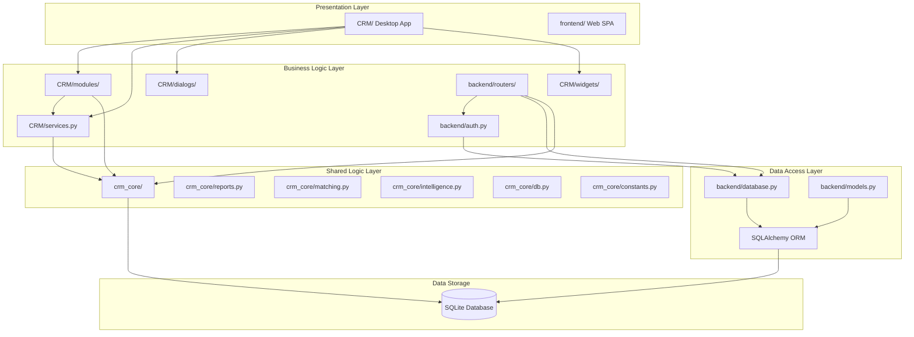

# 🔗 SECTION 3: DEPENDENCY GRAPH
## Engineering Audit - Real Estate CRM System

---

## 3.1 Executive Summary

The Real Estate CRM system exhibits a layered dependency structure with a shared business logic layer (`crm_core`) serving as the foundation. The dependency graph shows clear separation between Desktop (PySide6), Backend (FastAPI), and Shared (crm_core) layers, with some cross-layer interactions and circular dependencies that need attention.

**Key Findings:**
- **178 import statements** across CRM modules
- **27 import statements** across Backend modules
- **40 import statements** across crm_core modules
- **28 cross-layer references** from Desktop to Shared layer
- **13 cross-layer references** from Backend to Shared layer
- **No direct Desktop ↔ Backend circular dependencies** detected

---

## 3.2 Dependency Architecture

### 3.2.1 Layer Dependency Diagram

### 3.2.2 Dependency Flow Directions

| Source | Target | Direction | Count |
|--------|--------|-----------|-------|
| CRM Desktop | CRM Services | → | 15+ modules |
| CRM Desktop | crm_core | → | 28 references |
| CRM Modules | CRM Widgets | → | 10+ modules |
| CRM Modules | CRM Dialogs | → | 6 dialogs |
| Backend Routers | Backend Auth | → | 4 routers |
| Backend Routers | Backend Database | → | 4 routers |
| Backend Routers | crm_core | → | 13 references |
| crm_core | SQLite | → | Direct access |

---

## 3.3 Module-Level Dependencies

### 3.3.1 CRM Module Dependencies

| Module | Depends On | Type |
|--------|------------|------|
| `CRM/main.py` | `CRM/database`, `CRM/services`, `CRM/dialogs/login`, `CRM/dialogs/startup`, `CRM/app_window` | Core |
| `CRM/app_window.py` | `CRM/constants`, `CRM/utils`, `CRM/modules`, `CRM/models`, `CRM/dialogs`, `CRM/api`, `CRM/widgets`, `crm_core/reports`, `crm_core/intelligence`, `crm_core/constants` | Hub |
| `CRM/services.py` | `CRM/utils`, `crm_core/db`, `crm_core/constants` | Core |
| `CRM/database.py` | `CRM/utils`, `crm_core/constants` | Core |

### 3.3.2 CRM Feature Module Dependencies

| Module | Primary Dependencies | Secondary Dependencies |
|--------|---------------------|------------------------|
| `deals.py` | `data_table`, `models`, `services` | - |
| `financial.py` | `data_table`, `phase_one`, `models`, `services`, `constants` | - |
| `employees.py` | `data_table`, `models`, `services`, `attendance`, `salary` | - |
| `attendance.py` | `data_table`, `models`, `services`, `constants`, `utils`, `crm_core/attendance` | - |
| `salary.py` | `constants`, `utils`, `data_table`, `models`, `services`, `dialogs/record` | - |
| `reports.py` | `utils`, `models`, `services`, `constants`, `crm_core/reports`, `employees` | - |
| `ai_insights.py` | `services`, `constants` | - |
| `users.py` | `data_table`, `models`, `services`, `constants`, `dialogs/record`, `widgets/table` | - |
| `settings.py` | `constants`, `data_table`, `phase_one`, `models`, `services`, `dialogs/record` | - |
| `success_factors.py` | `constants`, `utils`, `models`, `services`, `widgets/table`, `dialogs/record`, `data_table` | - |
| `workflow.py` | `utils`, `models`, `services`, `constants`, `data_table`, `success_factors` | - |
| `phase_one.py` | `utils`, `models`, `services`, `constants`, `widgets/table`, `dialogs/*`, `database` | - |
| `data_table.py` | `constants`, `utils`, `widgets/table`, `models`, `services`, `protocols`, `dialogs/record`, `crm_core/constants` | - |
| `property_sync.py` | `constants`, `utils`, `crm_core/constants` | - |
| `report_helpers.py` | `constants`, `utils`, `crm_core/reports` | - |

### 3.3.3 Backend Router Dependencies

| Router | Primary Dependencies | Secondary Dependencies |
|--------|---------------------|------------------------|
| `auth_router.py` | `database`, `models`, `schemas`, `auth` | - |
| `records_router.py` | `backup`, `database`, `models`, `schemas`, `auth`, `crm_core/*` | - |
| `reports_router.py` | `database`, `config`, `models`, `auth`, `crm_core/*` | - |
| `public_router.py` | `database`, `models` | - |

### 3.3.4 crm_core Internal Dependencies

| Module | Depends On | Purpose |
|--------|------------|---------|
| `db.py` | - | Database access (no internal deps) |
| `constants.py` | - | Constants (no internal deps) |
| `date_utils.py` | - | Date utilities (no internal deps) |
| `formatters.py` | - | Data formatters (no internal deps) |
| `validators.py` | - | Data validators (no internal deps) |
| `paths.py` | - | Path utilities (no internal deps) |
| `ecosystem.py` | `paths` | Health checks |
| `attendance.py` | `constants` | Attendance calculations |
| `matching.py` | `constants` | Property matching |
| `intelligence.py` | `matching`, `constants` | AI/ML insights |
| `reports.py` | `db`, `matching`, `constants` | Report generation |

---

## 3.4 Dependency Hotspots

### 3.4.1 Most Depended-On Modules

| Rank | Module | Depended On By | Count |
|------|--------|----------------|-------|
| 1 | `CRM/services.py` | All CRM modules | 15+ |
| 2 | `CRM/constants.py` | Most CRM modules | 12+ |
| 3 | `CRM/models.py` | Most CRM modules | 12+ |
| 4 | `CRM/modules/data_table.py` | 8 modules | 8 |
| 5 | `crm_core/constants.py` | CRM + Backend | 10+ |
| 6 | `crm_core/db.py` | CRM + Backend | 5+ |
| 7 | `CRM/utils/__init__.py` | Most CRM modules | 10+ |

### 3.4.2 Most Dependent Modules (High Coupling)

| Rank | Module | Dependencies | Count |
|------|--------|--------------|-------|
| 1 | `CRM/app_window.py` | All layers | 15+ |
| 2 | `CRM/modules/phase_one.py` | Multiple modules | 11 |
| 3 | `CRM/modules/success_factors.py` | Multiple modules | 10 |
| 4 | `CRM/modules/data_table.py` | Multiple modules | 8 |
| 5 | `backend/routers/records_router.py` | Multiple layers | 8 |

---

## 3.5 Circular Dependencies

### 3.5.1 Identified Circular Patterns

| Pattern | Modules Involved | Severity | Impact |
|---------|-----------------|----------|--------|
| **CRM ↔ crm_core** | `CRM/services.py` → `crm_core/db.py` → `crm_core/reports.py` → `crm_core/matching.py` | Medium | Testing difficulty |
| **CRM modules ↔ CRM modules** | `employees.py` ↔ `attendance.py` ↔ `salary.py` | Low | Maintainability |
| **CRM ↔ CRM/widgets** | `data_table.py` → `widgets/table.py` → `utils` → `crm_core` | Low | Build complexity |

### 3.5.2 Circular Dependency Analysis

**Desktop → Shared Layer (28 references):**
- `CRM/app_window.py` imports from `crm_core/reports`, `crm_core/intelligence`, `crm_core/constants`
- `CRM/services.py` imports from `crm_core/db`, `crm_core/constants`
- `CRM/constants.py` imports from `crm_core/constants`
- `CRM/utils/__init__.py` imports from `crm_core/constants`, `crm_core/formatters`, `crm_core/validators`, `crm_core/date_utils`
- `CRM/modules/attendance.py` imports from `crm_core/attendance`
- `CRM/modules/reports.py` imports from `crm_core/reports`
- `CRM/modules/property_sync.py` imports from `crm_core/constants`
- `CRM/modules/report_helpers.py` imports from `crm_core/reports`
- `CRM/modules/data_table.py` imports from `crm_core/constants`
- `CRM/widgets/dashboard.py` imports from `crm_core/constants`
- `CRM/database.py` imports from `crm_core/constants`
- `CRM/api/desktop_server.py` imports from `crm_core/constants`

**Backend → Shared Layer (13 references):**
- `backend/routers/records_router.py` imports from `crm_core/attendance`, `crm_core/constants`, `crm_core/date_utils`, `crm_core/ecosystem`, `crm_core/formatters`, `crm_core/matching`, `crm_core/validators`
- `backend/routers/reports_router.py` imports from `crm_core/attendance`, `crm_core/matching`, `crm_core/reports`
- `backend/backup.py` imports from `crm_core/ecosystem`, `crm_core/paths`
- `backend/config.py` imports from `crm_core/paths`

**Desktop → Backend (1 reference):**
- `CRM/api/lan_server.py` imports from `backend.main`

**Backend → Desktop (0 references):**
- No direct dependencies found

---

## 3.6 External Dependencies

### 3.6.1 Python Package Dependencies

| Package | Used By | Purpose |
|---------|---------|---------|
| `PySide6` | CRM Desktop | Qt6 GUI framework |
| `FastAPI` | Backend API | Web framework |
| `SQLAlchemy` | Backend | ORM |
| `Pydantic` | Backend | Validation |
| `python-jose` | Backend | JWT tokens |
| `slowapi` | Backend | Rate limiting |
| `sqlite3` | crm_core, CRM | Database |

### 3.6.2 Standard Library Dependencies

| Module | Used By | Purpose |
|--------|---------|---------|
| `sqlite3` | crm_core/db.py | Database access |
| `hashlib` | backend/auth.py | Password hashing |
| `hmac` | backend/auth.py | HMAC |
| `datetime` | Multiple | Date/time handling |
| `json` | Multiple | Data serialization |
| `os` | Multiple | File system |
| `pathlib` | Multiple | Path handling |
| `logging` | Backend | Logging |
| `http.server` | CRM/api | HTTP server |
| `threading` | CRM/api | Background tasks |

---

## 3.7 Dependency Issues

### 3.7.1 Critical Issues

| # | Finding | Location | Impact | Risk | Recommendation |
|---|---------|----------|--------|------|----------------|
| 1 | **No Dependency Injection** | CRM/services.py | Tight coupling | High | Implement DI container |
| 2 | **Hardcoded Imports** | Multiple modules | Inflexibility | Medium | Use abstract interfaces |

### 3.7.2 High Priority Issues

| # | Finding | Location | Impact | Risk | Estimated Complexity | Regression Risk | Recommendation |
|---|---------|----------|--------|------|---------------------|-----------------|----------------|
| 3 | **Hub Module (app_window.py)** | CRM/app_window.py:2909 | Maintenance burden | High | High (3-5 days) | High | Split into smaller modules |
| 4 | **Mixed Dependency Levels** | CRM/modules/ | Coupling issues | Medium | Medium (1-2 days) | Medium | Enforce layer boundaries |
| 5 | **No Interface Contracts** | All modules | Integration risk | Medium | Medium (2-3 days) | Low | Add Protocol definitions |

### 3.7.3 Medium Priority Issues

| # | Finding | Location | Impact | Risk | Estimated Complexity | Regression Risk | Recommendation |
|---|---------|----------|--------|------|---------------------|-----------------|----------------|
| 6 | **Wildcard Imports** | phase_one.py:14, success_factors.py:13 | Namespace pollution | Medium | Low (4-6 hours) | Low | Use explicit imports |
| 7 | **Cross-Layer Import** | lan_server.py → backend.main | Architecture violation | Low | Low (2-4 hours) | Low | Use API abstraction |
| 8 | **Missing Abstractions** | crm_core/db.py | Testing difficulty | Medium | Medium (1-2 days) | Medium | Add repository interfaces |

### 3.7.4 Low Priority Issues

| # | Finding | Location | Impact | Risk | Recommendation |
|---|---------|----------|--------|------|----------------|
| 9 | **Unused Imports** | Various files | Code bloat | Low | Remove unused imports |
| 10 | **Inconsistent Import Style** | Various files | Readability | Low | Standardize import order |

---

## 3.8 Dependency Recommendations

### 3.8.1 Immediate Actions (Phase 3)

1. **Remove Wildcard Imports:**
   - Replace `from CRM.constants import *` with explicit imports
   - Replace `from CRM.utils import *` with explicit imports

2. **Split Hub Module:**
   - Extract navigation logic from `app_window.py`
   - Extract search logic from `app_window.py`
   - Extract settings logic from `app_window.py`

3. **Add Interface Contracts:**
   - Create Protocol classes for `CRMServices`
   - Create Protocol classes for `SQLiteRepository`
   - Create Protocol classes for `ReportService`

### 3.8.2 Short-Term Improvements (Phase 4)

1. **Implement Dependency Injection:**
   - Create DI container for CRM modules
   - Create DI container for Backend routers
   - Remove circular dependencies

2. **Enforce Layer Boundaries:**
   - Prevent CRM modules from importing from Backend
   - Prevent Backend from importing from CRM
   - Use `crm_core` as the only shared layer

3. **Add Dependency Documentation:**
   - Create dependency matrix
   - Document module responsibilities
   - Add import guidelines

### 3.8.3 Long-Term Enhancements (Phase 5-6)

1. **Plugin Architecture:**
   - Make modules loosely coupled
   - Allow dynamic module loading
   - Support feature toggles

2. **Dependency Management:**
   - Use dependency injection framework
   - Add dependency versioning
   - Implement dependency caching

---

## 3.9 Conclusion

The Real Estate CRM system has a well-structured dependency architecture with clear separation between Desktop, Backend, and Shared layers. The `crm_core` module serves as an effective shared business logic layer. However, there are opportunities to improve modularity by removing wildcard imports, adding interface contracts, and implementing dependency injection.

**Key Strengths:**
- Clear layer separation
- Shared business logic layer
- No Desktop ↔ Backend circular dependencies

**Key Weaknesses:**
- Hub module (app_window.py) too large
- Wildcard imports causing namespace pollution
- Missing interface contracts
- No dependency injection

**Overall Assessment:** The dependency architecture is functional but could benefit from improved modularity and interface definitions.

---

**Document Status:** ✅ Complete
**Last Updated:** 2026-07-15
**Author:** Buffy (AI Assistant)
