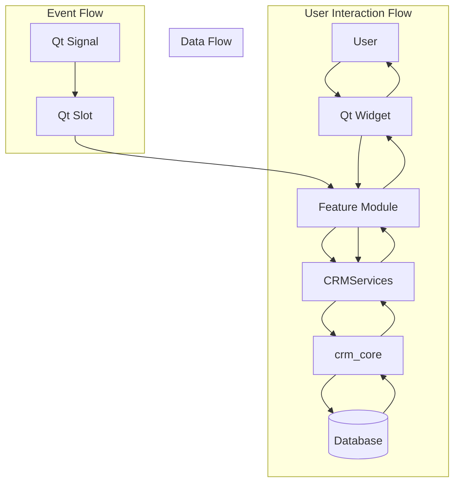
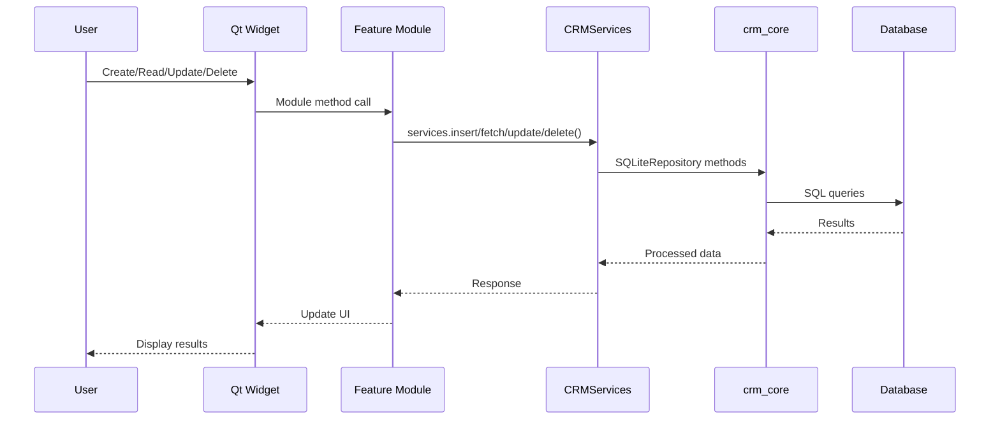
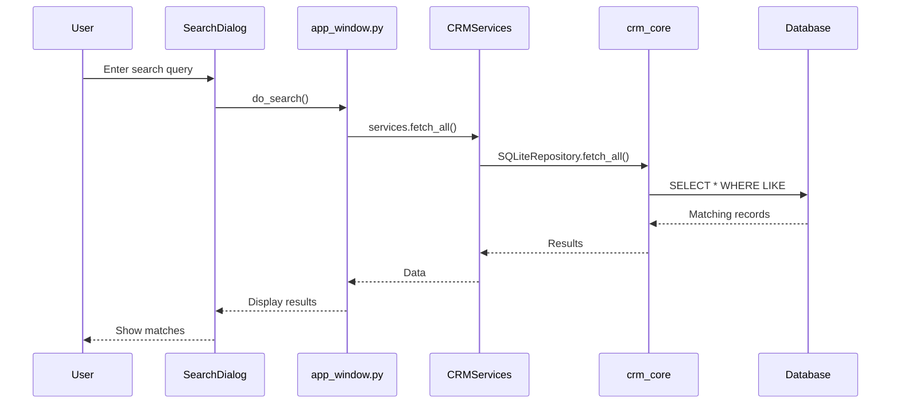
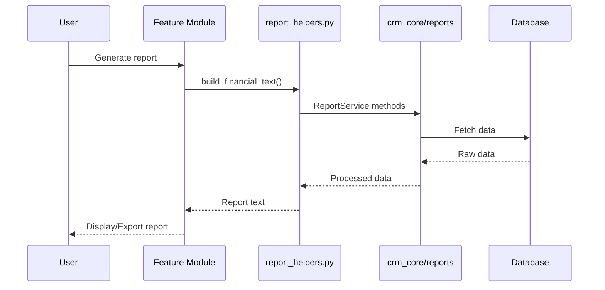
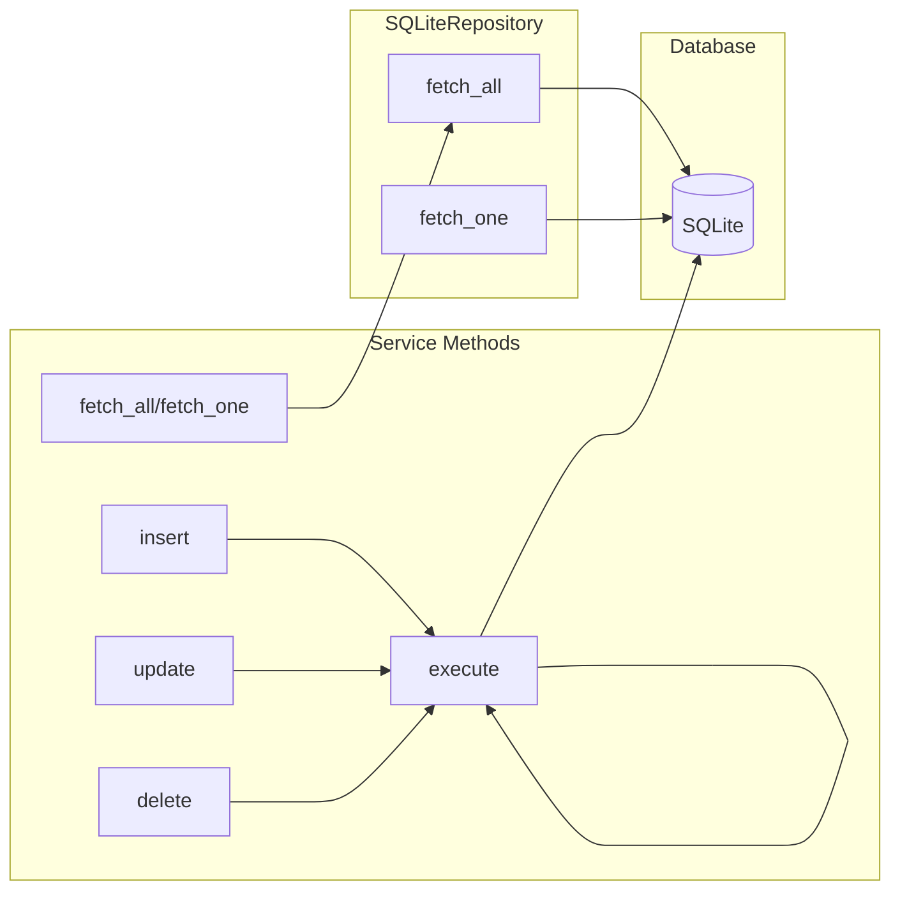

# 🔄 SECTION 4: MODULE INTERACTIONS
## Engineering Audit - Real Estate CRM System

---

## 4.1 Executive Summary

The Real Estate CRM system demonstrates well-defined module interactions with clear separation of concerns. Module interactions follow a hierarchical pattern where UI modules communicate through a central service layer, which in turn interacts with shared business logic modules.

**Key Findings:**
- **15+ feature modules** with distinct responsibilities
- **Centralized service layer** (`CRMServices`) handling all database operations
- **6 dialog types** for user interactions
- **5 reusable widget types** for UI components
- **3 API servers** for different access patterns

---

## 4.2 Interaction Patterns

### 4.2.1 Module Communication Patterns

### 4.2.2 Communication Mechanisms

| Mechanism | Used By | Purpose |
|-----------|---------|---------|
| **Method Calls** | All modules | Synchronous communication |
| **Qt Signals/Slots** | UI widgets | Asynchronous UI updates |
| **Service Methods** | All modules | Database operations |
| **Constants** | All modules | Shared configuration |

---

## 4.3 Module Interaction Matrix

### 4.3.1 CRM Modules Interaction

| Module | Interacts With | Interaction Type |
|--------|----------------|------------------|
| `deals.py` | `data_table`, `models`, `services` | Direct calls |
| `financial.py` | `data_table`, `phase_one`, `models`, `services` | Direct calls |
| `employees.py` | `data_table`, `models`, `services`, `attendance`, `salary` | Direct calls |
| `attendance.py` | `data_table`, `models`, `services`, `crm_core/attendance` | Direct calls |
| `salary.py` | `constants`, `utils`, `data_table`, `models`, `services` | Direct calls |
| `reports.py` | `utils`, `models`, `services`, `crm_core/reports`, `employees` | Direct calls |
| `ai_insights.py` | `services`, `constants` | Direct calls |
| `users.py` | `data_table`, `models`, `services`, `constants` | Direct calls |
| `settings.py` | `constants`, `data_table`, `phase_one`, `models`, `services` | Direct calls |
| `success_factors.py` | `constants`, `utils`, `models`, `services`, `widgets/table` | Direct calls |
| `workflow.py` | `utils`, `models`, `services`, `constants`, `data_table`, `success_factors` | Direct calls |
| `phase_one.py` | `utils`, `models`, `services`, `constants`, `widgets/table`, `dialogs/*` | Direct calls |
| `data_table.py` | `constants`, `utils`, `widgets/table`, `models`, `services` | Direct calls |
| `property_sync.py` | `constants`, `utils`, `crm_core/constants` | Direct calls |
| `report_helpers.py` | `constants`, `utils`, `crm_core/reports` | Direct calls |

### 4.3.2 Dialog Interactions

| Dialog | Used By | Interaction |
|--------|---------|-------------|
| `LoginDialog` | `main.py`, `app_window.py` | Authentication flow |
| `StartupDialog` | `main.py`, `app_window.py` | Startup progress |
| `RecordDialog` | Most modules | CRUD operations |
| `SearchDialog` | `app_window.py` | Search functionality |
| `ReportPreviewDialog` | `reports.py` | Report viewing |
| `CommentDialog` | `phase_one.py` | Comment management |

### 4.3.3 Widget Interactions

| Widget | Used By | Interaction |
|--------|---------|-------------|
| `DashboardWidget` | `app_window.py` | Dashboard display |
| `ExcelTableWidget` | Most modules | Data display |
| `DashboardBarChart` | `dashboard.py`, `charts.py` | Chart display |
| `DashboardDonut` | `dashboard.py`, `charts.py` | Chart display |
| `DashboardLineChart` | `dashboard.py`, `charts.py` | Chart display |
| `MetricCard` | `dashboard.py`, `cards.py` | Metric display |
| `NavItem` | `app_window.py`, `cards.py` | Navigation |
| `WrappingItemDelegate` | `table.py` | Cell rendering |

---

## 4.4 Data Flow Patterns

### 4.4.1 CRUD Operations Flow

### 4.4.2 Search Flow

### 4.4.3 Report Generation Flow

---

## 4.5 Service Layer Interactions

### 4.5.1 CRMServices Methods

| Method | Called By | Purpose |
|--------|-----------|---------|
| `fetch_all(table, filters)` | Most modules | List records |
| `fetch_one(table, record_id)` | Most modules | Get single record |
| `insert(table, data)` | Most modules | Create record |
| `update(table, record_id, data)` | Most modules | Update record |
| `delete(table, record_id)` | Most modules | Delete record |
| `execute(sql, params)` | Specialized modules | Custom queries |
| `login(username, password)` | LoginDialog | Authentication |
| `create_user(data)` | UsersModule | User creation |
| `change_password(user_id, old, new)` | UsersModule | Password change |
| `settings_get(key)` | Multiple modules | Get setting |
| `settings_set(key, value)` | Multiple modules | Set setting |
| `submit_approval(data)` | Multiple modules | Submit for approval |
| `review_approval(id, action)` | Managers | Review approval |

### 4.5.2 Service Layer Data Flow

---

## 4.6 Cross-Module Interactions

### 4.6.1 Module-to-Module Dependencies

| Source Module | Target Module | Interaction |
|---------------|---------------|-------------|
| `employees.py` | `attendance.py` | Embeds AttendancePage |
| `employees.py` | `salary.py` | Embeds SalaryPage |
| `financial.py` | `phase_one.py` | Uses SummaryPage |
| `settings.py` | `phase_one.py` | Uses SettingsListEditor |
| `reports.py` | `employees.py` | Uses report utilities |
| `workflow.py` | `success_factors.py` | Embeds workflow specs |

### 4.6.2 Shared Component Usage

| Component | Used By Modules | Purpose |
|-----------|-----------------|---------|
| `DataTablePage` | 8 modules | Generic data table |
| `RecordDialog` | 6 modules | Record editing |
| `ExcelTableWidget` | 5 modules | Table display |
| `configure_multi_select_table` | 4 modules | Table configuration |
| `safe_float` | 6 modules | Data parsing |
| `format_date_display` | 5 modules | Date formatting |

---

## 4.7 API Server Interactions

### 4.7.1 Desktop Server

| Endpoint | Purpose | Called By |
|----------|---------|-----------|
| `/api/records` | CRUD operations | Desktop UI |
| `/api/search` | Search records | Desktop UI |
| `/api/reports` | Generate reports | Desktop UI |
| `/api/settings` | Get/set settings | Desktop UI |

### 4.7.2 LAN Server

| Endpoint | Purpose | Called By |
|----------|---------|-----------|
| `/` | Serve frontend | Web browser |
| `/api/*` | Proxy to desktop | Web browser |

### 4.7.3 Backend API

| Endpoint | Purpose | Called By |
|----------|---------|-----------|
| `/auth/*` | Authentication | Web clients |
| `/records/*` | CRUD operations | Web clients |
| `/reports/*` | Report generation | Web clients |
| `/properties` | Public listings | External clients |

---

## 4.8 Event-Driven Interactions

### 4.8.1 Qt Signal/Slot Connections

| Signal Source | Slot Target | Event |
|---------------|-------------|-------|
| `QPushButton.clicked` | Module methods | Button clicks |
| `QLineEdit.textChanged` | Search filters | Text input |
| `QComboBox.currentIndexChanged` | Filter updates | Selection change |
| `QTableWidget.cellClicked` | Record selection | Row selection |
| `QAction.triggered` | Menu actions | Menu clicks |

### 4.8.2 Callback Interactions

| Callback | Registered By | Purpose |
|----------|----------------|---------|
| `refresh_callback` | AppWindow → Modules | Data refresh |
| `progress_callback` | StartupDialog → Services | Startup progress |
| `search_callback` | SearchDialog → AppWindow | Search execution |

---

## 4.9 Interaction Issues

### 4.9.1 Critical Issues

| # | Finding | Location | Impact | Risk | Estimated Complexity | Regression Risk | Recommendation |
|---|---------|----------|--------|------|---------------------|-----------------|----------------|
| 1 | **Tight Module Coupling** | CRM/modules/ | Maintenance burden | High | High (3-5 days) | High | Apply Interface Segregation |
| 2 | **No Event Bus** | All modules | Scalability limit | Medium | High (2-3 days) | Medium | Implement event system |

### 4.9.2 High Priority Issues

| # | Finding | Location | Impact | Risk | Estimated Complexity | Regression Risk | Recommendation |
|---|---------|----------|--------|------|---------------------|-----------------|----------------|
| 3 | **Mixed Responsibilities** | phase_one.py:1635 | God module | High | High (3-5 days) | High | Split into smaller modules |
| 4 | **Direct DB Access** | Some modules | Bypass service layer | Medium | Medium (1-2 days) | Medium | Enforce service layer usage |
| 5 | **No Interaction Contracts** | All modules | Integration risk | Medium | Medium (2-3 days) | Low | Add Protocol definitions |

### 4.9.3 Medium Priority Issues

| # | Finding | Location | Impact | Risk | Estimated Complexity | Regression Risk | Recommendation |
|---|---------|----------|--------|------|---------------------|-----------------|----------------|
| 6 | **Synchronous Blocking** | Long operations | UI freezing | Medium | Medium (1-2 days) | Medium | Add async processing |
| 7 | **No Interaction Logging** | All modules | Debugging difficulty | Low | Low (4-6 hours) | Low | Add interaction logging |
| 8 | **Inconsistent Error Handling** | Multiple modules | Unpredictable behavior | Medium | Medium (1-2 days) | Medium | Standardize error handling |

### 4.9.4 Low Priority Issues

| # | Finding | Location | Impact | Risk | Estimated Complexity | Regression Risk | Recommendation |
|---|---------|----------|--------|------|---------------------|-----------------|----------------|
| 9 | **No Interaction Tests** | tests/ | Integration risk | Medium | Medium (2-3 days) | Low | Add interaction tests |
| 10 | **Hardcoded Interactions** | Multiple modules | Inflexibility | Low | Low (4-6 hours) | Low | Use configuration |

---

## 4.10 Interaction Recommendations

### 4.10.1 Immediate Actions (Phase 3)

1. **Split Phase One Module:**
   - Extract `PhaseOneDesk` into separate navigation module
   - Extract `SummaryPage` into dashboard module
   - Extract `SettingsListEditor` into settings utilities

2. **Enforce Service Layer:**
   - Add warnings for direct database access
   - Create service layer decorators
   - Document service layer API

3. **Add Interaction Logging:**
   - Log all service method calls
   - Log all database queries
   - Log all UI interactions

### 4.10.2 Short-Term Improvements (Phase 4)

1. **Implement Event Bus:**
   - Create event system for module communication
   - Decouple modules from direct dependencies
   - Support publish-subscribe pattern

2. **Add Interaction Contracts:**
   - Create Protocol classes for all services
   - Define interaction interfaces
   - Add type hints

3. **Standardize Error Handling:**
   - Create error hierarchy
   - Add error recovery mechanisms
   - Implement error logging

### 4.10.3 Long-Term Enhancements (Phase 5-6)

1. **Async Processing:**
   - Move long operations to background threads
   - Add progress indicators
   - Implement cancellation support

2. **Interaction Testing:**
   - Add integration tests
   - Add interaction mocks
   - Add performance tests

---

## 4.11 Conclusion

The Real Estate CRM system has well-structured module interactions with clear separation of concerns. The service layer effectively centralizes database operations, and the module hierarchy provides good maintainability. However, there are opportunities to improve decoupling through event-driven patterns, interface contracts, and async processing.

**Key Strengths:**
- Clear service layer abstraction
- Consistent module patterns
- Good use of Qt signals/slots

**Key Weaknesses:**
- Tight coupling in some modules
- Mixed responsibilities in phase_one.py
- Synchronous blocking operations
- No interaction contracts

**Overall Assessment:** The module interactions are well-designed but could benefit from improved decoupling and async processing.

---

**Document Status:** ✅ Complete
**Last Updated:** 2026-07-15
**Author:** Buffy (AI Assistant)
