# SECTION 6: ENTITY RELATIONSHIPS
## Engineering Audit - Real Estate CRM System

**Date:** 2026-07-15  
**Depends on:** Section 5 (Database Design)  
**Evidence:** Live `PRAGMA foreign_key_list`, `backend/models.py`, `CRM/database.py`, archive/close flow in `backend/routers/records_router.py`

---

## 6.1 Analysis

The CRM uses two relationship styles:

1. **Declared FK relationships** — a minority of tables (`login_logs` in ORM only, SF, WF, some HR extras, `rent_matches`).
2. **Logical / denormalized relationships** — deal boards link to people and inventory via free-text names and phones; archives link via `(source_table, source_id)`.

That split is typical of field-entry CRM evolution, but it limits referential integrity and multi-agency scalability.

---

## 6.2 Entity-relationship map

```mermaid
erDiagram
    users ||--o{ login_logs : "user_id (ORM FK)"
    users ||--o{ audit_logs : "username TEXT (logical)"

    clients ||..o{ rent_requirements : "client_name TEXT only"
    clients ||..o{ sale_requirements : "client_name TEXT only"
    broker_contacts ||..o{ rent_availability : "names/phones TEXT"
    properties ||..o{ income_transactions : "property_id NO FK"
    properties ||..o{ expense_transactions : "property_id NO FK"

    rent_requirements ||--o{ rent_matches : "requirement_id FK"
    rent_availability ||--o{ rent_matches : "availability_id FK"
    rent_availability ||--o| rented_properties : "source_table+source_id UNIQUE"
    sale_availability ||--o| sold_properties : "source_table+source_id UNIQUE"

    employees ||--o{ attendance : "employee_id logical (no live FK)"
    employees ||--o{ salary_payments : "employee_id logical (no live FK)"
    employees ||--o{ employee_attendance : "FK"
    employees ||--o{ employee_commissions : "FK"
    employees ||--o{ employee_payroll : "FK"
    employees ||--o{ employee_performance : "FK"

    sf_employees ||--o{ sf_performance_goals : "employee_id FK"
    sf_employees ||--o{ sf_learning : "employee_id FK"
    sf_employees ||--o{ sf_compensation : "employee_id logical"
    sf_employees ||--o{ sf_onboarding : "employee_id logical"

    wf_workflows ||--o{ wf_workflow_steps : "workflow_id FK"
    wf_workflows ||--o{ wf_instances : "workflow_id FK"
    wf_instances ||--o{ wf_tasks : "instance_id FK"
    wf_instances ||--o{ wf_approvals : "logical"
    wf_instances ||--o{ wf_notifications : "logical"
    wf_instances ||--o{ wf_sla_log : "logical"
    wf_instances ||--o{ wf_audit_log : "logical"

    rent_availability ||..o{ pending_approvals : "table_name+record_id"
    sale_availability ||..o{ pending_approvals : "table_name+record_id"
```

---

## 6.3 Cardinality summary

| From | To | Cardinality | Mechanism | Integrity |
|------|----|-------------|-----------|-----------|
| User | LoginLog | 1:N | ORM `ForeignKey` | Declared; verify live DDL |
| User | AuditLog | 1:N | username string | Weak |
| Client | Requirement deals | 1:N | name match | None |
| BrokerContact | Availability | 1:N | name/phone | None |
| Property inventory | Financial tx | 1:N | `property_id` | No FK |
| Requirement ↔ Availability | Match | N:M via `rent_matches` | FK both sides | Strongest deal link |
| Availability | Archive (rented/sold) | 1:0..1 | UNIQUE source | Strong for archive identity |
| Employee | Attendance / Salary | 1:N | integer id | Declared in ORM/export; **not** on live attendance/salary |
| Workflow | Steps / Instances / Tasks | 1:N | FK chain | Good for WF subgraph |
| Approval queue | Any record | N:1 polymorphic | `table_name` + `record_id` | No FK possible |

---

## 6.4 Close / archive relationship (critical business path)

On close (`archive_closed_availability_record` in `records_router.py`):

1. Source availability row → soft-deleted (`is_deleted=1`), stage → Deal Done.  
2. Snapshot inserted/updated in `rented_properties` or `sold_properties` keyed by `(source_table, source_id)`.  
3. **No** mandatory link to `clients`, `properties`, installment schedule, or commission ledger.

**Cascade risk:** Deleting a soft-deleted source row later does not cascade-delete archive (archives are independent snapshots — correct). Hard-deleting clients does not affect deals (also correct given no FK, but leaves orphan names).

**Orphan risk:** `rent_matches` FKs can orphan if requirement/availability hard-deleted while matches remain (depends on SQLite FK + open pragma at write time).

---

## 6.5 Missing domain entities (Prompt real-estate scope)

| Domain need | Present? | Evidence |
|-------------|----------|----------|
| Lead → Close pipeline fields | Partial | `workflow_stage`, probability on deal boards |
| Site visits / meetings | No dedicated table | Remarks / follow-up TEXT only |
| Token / booking | No | — |
| Installments | No | Flagged Critical in TRACK_CHANGES |
| Documentation / legal files | No dedicated doc table | `photo_paths` TEXT only |
| Transfer / registry | No | — |
| Commission ledger | Partial | `employee_commissions` + rate on employees; not deal-linked receipt flow |
| Cash / bank book / journal / ledger | No | Income/expense lists only |
| Projects / builders / investors | No first-class entities | Text in remarks/location |
| Owners as party master | Weak | `owner_name` on listings; `clients` used loosely |
| Agents / dealers / marketing partners | Weak | `broker_contacts` + free text |

Recommendation: add entities in Phase 5 as **new tables with optional FKs**, linking to existing deal IDs — do not rewrite deal boards.

---

## 6.6 Findings (ranked)

### Critical

| ID | Problem | Impact | Risk | Recommended solution | Complexity | Regression |
|----|---------|--------|------|----------------------|------------|------------|
| R-C1 | **No party master linkage** from deals to `clients` / owners / brokers | Duplicate contacts; broken CRM “customer 360” | Wrong follow-ups / legal notify | Optional `client_id`, `broker_id`, `owner_client_id` columns + UI picker; keep TEXT for display | Med–High | Med |
| R-C2 | **Closed deal has no money graph** (token, installments, commission, receipt) | Archive is inventory snapshot only | Financially incorrect closed book | New `deal_financials` / `installments` / `commission_entries` referencing archive or source id | High | Med |

### High

| ID | Problem | Impact | Risk | Recommended solution | Complexity | Regression |
|----|---------|--------|------|----------------------|------------|------------|
| R-H1 | `properties` inventory parallel to availability boards | Two truths for stock | Agents work wrong list | Sync rules or designate availability as operational stock; inventory as catalog | High | High |
| R-H2 | Polymorphic `pending_approvals` without integrity | Approve deleted / wrong table | Bad approvals | Validate `(table_name, record_id)` exists before apply; status machine | Med | Low |
| R-H3 | `employees` vs `sf_employees` dual HR graphs | Split manpower truth | Payroll/goal mismatch | Map SF employee ↔ CRM employee or merge policy | Med | Med |
| R-H4 | Live attendance/salary missing FK | Orphans possible | Payroll errors | Clean orphans; add FK | Low–Med | Low |

### Medium

| ID | Problem | Impact | Risk | Recommended solution | Complexity | Regression |
|----|---------|--------|------|----------------------|------------|------------|
| R-M1 | Sale side lacks symmetric `sale_matches` table (only `rent_matches` observed) | Asymmetric matching feature | UX/feature gap | Add `sale_matches` mirroring rent | Med | Low |
| R-M2 | Three audit entities | Split history | Compliance | Canonicalize (see D-C4) | Med | Med |
| R-M3 | WF subgraph well-related but weakly tied to CRM deal tables | Workflows may not bind to rent/sale records | Shadow processes | `entity_table` + `entity_id` on `wf_instances` | Med | Med |

### Low

| ID | Problem | Impact | Risk | Recommended solution | Complexity | Regression |
|----|---------|--------|------|----------------------|------------|------------|
| R-L1 | `financial_summary` single-row aggregate | Stale KPI cache risk | Wrong dashboard | Derive from transactions or refresh job | Low | Low |

---

## 6.7 Recommendations

1. Keep denormalized deal entry for UX; **add nullable FKs** alongside text fields.  
2. Promote `(source_table, source_id)` archive pattern as the official “closed deal” identity for financial child tables.  
3. Complete FK enforcement on HR leave tables; keep soft policies `NO ACTION` / `RESTRICT` (never silent CASCADE on money/HR without review).  
4. Phase 5: installments + commissions keyed to archive id; documents keyed to deal id.  
5. Prefer extending `rent_matches` pattern to sale over inventing a new matching model.

---

## 6.8 Engineering rationale

- Relationships must reflect how agents work (boards + free text) while enabling integrity where IDs already exist (matches, archives, WF).  
- Forced immediate normalization of names → clients would break production entry speed and risk data loss — violates Prompt “preserve business value first.”  
- Missing financial child entities are domain gaps ranked Critical for enterprise readiness, not cosmetic ER purity.

---

## 6.9 Implementation plan (future phases)

| Step | Phase | Action |
|------|-------|--------|
| 1 | 4 | Add missing FKs/indexes; orphan cleanup |
| 2 | 4 | Document ER as living diagram regenerated from PRAGMA |
| 3 | 5 | `sale_matches`; optional party FKs on deals |
| 4 | 5 | Installment + commission children of archive |
| 5 | 5 | Bind `wf_instances` to CRM entities |
| 6 | 9 | Referential integrity tests |

---

## 6.10 Code changes

**None.** Audit-only.

---

## 6.11 Validation results

| Check | Result |
|-------|--------|
| Live FK tables | `employee_*`, `rent_matches`, `sf_performance_goals`, `wf_workflow_steps`, `wf_instances`, `wf_tasks` |
| Archive uniqueness | `idx_*_source` / UNIQUE on `(source_table, source_id)` |
| Deal ↔ client FK | None |
| Installment / transfer / registry tables | Absent |

---

## 6.12 Next proposed phase step

**Section 7: UI Flow** — map screens to these entities and confirm which relationships the UI never exposes (e.g. matches, archives, approvals).
