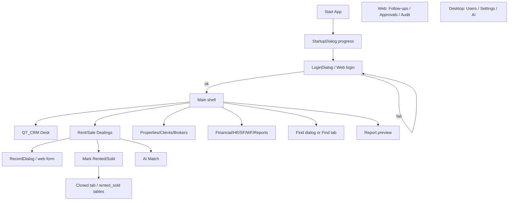

# SECTION 7: UI FLOW
## Engineering Audit - Real Estate CRM System

**Date:** 2026-07-15  
**Depends on:** Sections 1–2, 4–6  
**Evidence:** `CRM/app_window.py`, `CRM/modules/deals.py`, `CRM/modules/data_table.py`, `CRM/dialogs/*`, `CRM/constants.py` (search sources), `crm_core/constants.py` (roles), `frontend/index.html`, `frontend/app.js`, Phase 1 `UI_FLOWS.md`

---

## 7.1 Analysis

### Surfaces

| Surface | Entry | Shell | Auth |
|---------|-------|-------|------|
| **Qt Desktop** | `CRM/main.py` → StartupDialog → LoginDialog → `ModernCRMWindow` | Sidebar + `QStackedWidget` + menu bar + status bar | Local SHA-256 via `CRMServices.login` |
| **LAN Web** | `frontend/index.html` + FastAPI | Sidebar tabs + table tools + loading overlays | JWT / API login (`showLogin` / `showMain`) |

Both surfaces share the same SQLite operational model; UX parity is **intentional but incomplete**.

### Desktop navigation (permission-gated)

Built in `_build_pages()` (`CRM/app_window.py`):

| Section | Keys | Gating |
|---------|------|--------|
| QT CRM | `phase1` | Always (for logged-in users with pages built) |
| Overview | `dashboard` | Hidden when `is_staff_restricted()` |
| Deal desk | `rent`, `sale` | `rent`/`rent_view`, `sale`/`sale_view` |
| Records | `properties`, `clients`, `broker_contacts` | `properties`, `clients` |
| Operations | `financials`, `employees`, `successfactors`, `workflow`, `reports` | Matching `*_view` / module perms |
| Intelligence | `ai` | `ai` |
| Admin | `users`, `settings` | Admin roles / `settings` |

Default landing: **first nav key** (typically QT_CRM Desk).

### Web navigation (from `index.html`)

Present as first-class tabs: Phase1, Dashboard, Rent, Sale, Properties, Clients, Brokers, **Find**, **Follow-ups**, Financial, Employees, SF, Workflow, Reports, **Approvals**, **Audit**.

**Absent / weak on web vs desktop:** Users admin, Settings, AI Insights (desktop module exists; web nav does not expose equivalent).

**Absent / weak on desktop vs web:** dedicated Follow-ups page, Approvals page, Audit page (desktop writes audit into `wf_audit_log` / uses dashboard pending counts; search is modal dialog not a page).

### Core interaction pattern (both)

```
List (DataTable / HTML table)
  → Add/Edit dialog or form
  → Save → refresh list
  → Soft-delete / approval (role-dependent)
Deal availability → Mark Rented/Sold → archive tab
Optional: AI Match, workflow stage buttons, keyword filter, sort
```

### Deal UI composition (desktop)

`DealModule` tabs: **Requirements | Availability | Rented/Sold**. Extra actions include Mark Pending, AI Match, Mark Rented/Sold. Phase One Desk duplicates the four deal boards in a “data desk” layout — **two paths to the same entities**.

### Global Find (desktop)

`SearchDialog` + `GLOBAL_SEARCH_SOURCES` covers deals, archives, clients, brokers, properties, employees, income/expense, attendance, salary, many SF tables, and selected WF tables — permission-filtered via `allowed_find_sources`. Strong relative to Prompt search requirements for core entities; **documents / receipts as first-class** still N/A (no tables).

### Shortcuts (desktop) — high power-user value

Examples from `_build_menu`: Ctrl+N / Ctrl+Shift+N (rent create), Ctrl+F Find, F5 Refresh, Ctrl+1..9 View pages, Ctrl+B backup, Ctrl+E export, Ctrl+L logout, F1 guide.

### Roles affecting UI

| Role | UI implication |
|------|----------------|
| Super Admin / Admin | Full nav including Users/Settings |
| Manager | Ops without users/settings/backup/delete |
| Staff | Rent/sale/reports/wf_view; dashboard restricted path |
| Viewer | View-ish deal permissions + reports |

---

## 7.2 End-to-end UI flow map



---

## 7.3 Findings (ranked)

### Critical

| ID | Problem | Impact | Risk | Recommended solution | Complexity | Regression |
|----|---------|--------|------|----------------------|------------|------------|
| U-C1 | **Agency pipeline stages in docs/UI labels (Token, Installments, Registry) lack dedicated screens** | Agents cannot execute Prompt workflow beyond status text | Process stalled in software | Phase 5: stage-aware panels or child screens keyed to deal id — not new parallel CRM | High | Med |
| U-C2 | **Desktop ↔ Web nav parity gaps** (web: Follow-ups/Approvals/Audit; desktop: Users/Settings/AI; Find as dialog vs page) | Training split; “I can’t find X” support load | Wrong client used for critical ops | Define a **capability matrix**; expose missing flows on both (thin wrappers OK) | Med–High | Med |

### High

| ID | Problem | Impact | Risk | Recommended solution | Complexity | Regression |
|----|---------|--------|------|----------------------|------------|------------|
| U-H1 | **Dual deal entry: Phase1 Desk + DealModule** for same four tables | Cognitive load; inconsistent buttons/filters | Users edit on one surface, miss archive actions on the other | Keep both only if roles differ; otherwise make Desk a shortcut launcher into DealModule with same action bar | Med | Med |
| U-H2 | **SF/WF menu entries only `switch_page` + `update_status_bar`** — do not select inner tabs | Fake navigation; wasted clicks | Trust loss | Wire menu actions to `QTabWidget.setCurrentIndex` / select by tab title | Low | Low |
| U-H3 | **Closed-deal financial next steps invisible** after Mark Rented/Sold | Archive appears “done” but money/docs not started | Incomplete closings | Post-close wizard: commission, receipt, installment schedule (Phase 5) | High | Med |
| U-H4 | **Approvals on desktop not a primary nav item** (web has Approvals tab; desktop uses dashboard count + service methods) | Approvers miss queue | SLA misses | Add Approvals page or persistent badge on sidebar | Med | Low |

### Medium

| ID | Problem | Impact | Risk | Recommended solution | Complexity | Regression |
|----|---------|--------|------|----------------------|------------|------------|
| U-M1 | Bulk of list UIs lack strong **empty-state guidance** (what to add next) | New users stall | Low adoption | Empty copy + primary CTA per table | Low | Low |
| U-M2 | Desktop global loading less consistent than web `table-loading` overlays on long refreshes | Perceived freeze | Force quit | Busy cursor / progress on `refresh_all_pages` and large Find | Low–Med | Low |
| U-M3 | Search omits receipts/documents (because no tables) and some domain entities | Prompt search gap | Missed records | Expand sources as tables appear; add Document entity later | Depends | Low |
| U-M4 | Viewer/Staff gating differs slightly between surfaces | Permission confusion | Accidental access attempts | Single permission → nav visibility helper shared web/desktop | Med | Med |
| U-M5 | Phase1 verification status options include Registry/Transfer labels without workflow screens | Misleading completeness | False confidence | Either link to future modules or rename until real | Low | Low |

### Low

| ID | Problem | Impact | Risk | Recommended solution | Complexity | Regression |
|----|---------|--------|------|----------------------|------------|------------|
| U-L1 | Status bar deal counts on every `update_status_bar` hit DB COUNT | Minor UI lag | Noise | Cache counts on refresh timer | Low | Low |
| U-L2 | Menu “Edit” section not present (create via File→New only) | Discoverability | — | Optional Edit menu mirroring RecordDialog open | Low | Low |

---

## 7.4 Recommendations

1. **Capability matrix document** (desktop vs web): Find, Follow-ups, Approvals, Audit, Users, Settings, AI — close gaps incrementally in Phase 6.
2. **Fix SF/WF menu → tab selection** immediately (tiny, high trust ROI) when Phase 6 starts.
3. Preserve table+filter+dialog pattern — it is efficient; improve empty/loading states rather than redesigning chrome.
4. Treat Mark Rented/Sold as start of close process, not end (hook Phase 5).
5. Do not merge Phase1 Desk and DealModule until you measure which path agents prefer; first unify action affordances.

---

## 7.5 Engineering rationale

Prompt requires reducing clicks and cognitive load while respecting existing architecture. The shell (sidebar + stack + DataTablePage) is sound. Main deficits are **parity**, **dead menu actions**, and **workflow stages that are labels without UI** — business-process gaps expressed as UX gaps, not a reason for a visual redesign.

---

## 7.6 Implementation plan (Phase 6 — not executed now)

| Priority | Item |
|----------|------|
| P0 | SF/WF menu select real tabs |
| P1 | Approvals nav/badge on desktop |
| P1 | Follow-ups view on desktop (reuse web query logic) |
| P2 | Unify Phase1 vs DealModule action bars |
| P2 | Empty states + refresh busy indication |
| P3 | Post-close wizard hooks |

---

## 7.7 Code changes

**None.** Audit-only (Phase 2).

---

## 7.8 Validation results

| Check | Result |
|-------|--------|
| Desktop pages permission-gated | Confirmed in `_build_pages` |
| Deal tabs Requirements/Availability/Closed | Confirmed `CRM/modules/deals.py` |
| Find sources breadth | Confirmed `GLOBAL_SEARCH_SOURCES` in `CRM/constants.py` |
| Web tabs Follow-ups/Approvals/Audit | Confirmed `frontend/index.html` |
| SF menu deep-link | Status bar only — confirmed `_build_menu` lambdas |
| Loading indicators | Startup progress + web overlays confirmed; desktop refresh weak |

---

## 7.9 Next proposed phase step

**Section 8: Business Workflows** — compare real agency pipeline (Lead→…→Closed→Retention) to `DEAL_STAGES` / UI actions / archive behavior; recommend gaps without rewriting boards.
