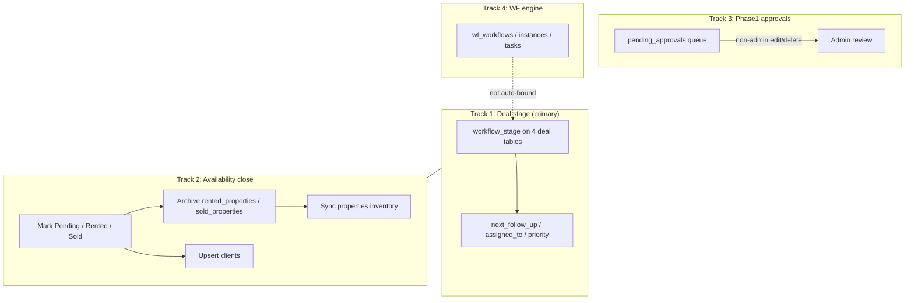

# SECTION 8: BUSINESS WORKFLOWS
## Engineering Audit - Real Estate CRM System

**Date:** 2026-07-15  
**Depends on:** Sections 5–7 (Database, ER, UI Flow)  
**Evidence:** `crm_core/constants.py`, `crm_core/matching.py`, `CRM/app_window.py`, `CRM/modules/deals.py`, `CRM/modules/property_sync.py`, `CRM/modules/data_table.py`, `backend/routers/records_router.py`, `frontend/app.js`, `database_setup.py` (`rent_matches`)

---

## 8.1 Analysis

### Industry reference pipeline (Prompt)

```
Lead → Inquiry → Qualification → Follow-up → Meeting → Property Visit →
Negotiation → Token → Booking → Installments → Documentation →
Transfer → Registry → Closed → Customer Retention
```

### Implemented pipeline (`DEAL_STAGES` in `crm_core/constants.py`)

```
Lead → Contacted → Visit Scheduled → Negotiation → Title Verified →
Pending → Closed → Deal Done
```

With `STAGE_PROBABILITY` mapping (10% → 100%) and `lost_reason` column on deal tables (no dedicated **Lost** stage).

### Operational model (how agencies actually work in this CRM)

The product separates **demand** and **supply** into four boards:

| Board | Table | Primary actor |
|-------|-------|---------------|
| Rent demand | `rent_requirements` | Tenant / buyer client |
| Rent supply | `rent_availability` | Owner / broker |
| Sale demand | `sale_requirements` | Buyer |
| Sale supply | `sale_availability` | Seller |

**Close** is availability-centric: marking **Rented** / **Sold** on supply rows drives archive, inventory sync, and client upsert — not a symmetric close on the matched requirement row.

---

## 8.2 Workflow systems (four parallel tracks)



| Track | Trigger | Persistence | UI surfaces |
|-------|---------|-------------|-------------|
| Deal stage | Manual buttons / API | `workflow_stage`, probability, dates | Column display; web `markAvailability`; API `PUT /workflow` |
| Close/archive | Rented/Sold on availability | Archive + soft-delete source | DealModule buttons; auto on save if status already closed |
| Phase1 approval | Non-admin edit/delete | `pending_approvals` | Web Approvals tab; Phase1 desk; dashboard count |
| WF engine | Manual CRUD | `wf_*` tables | Workflow module tabs; generic |

---

## 8.3 Implemented business flows (evidence)

### A. Lead capture → listing

1. Agent adds requirement or availability (desktop `RecordDialog` / web form / Phase1 desk).  
2. `after_record_saved` → alias sync, optional `upsert_client_from_deal`, property sync if availability.  
3. Default `workflow_stage` = **Lead** (migration backfill).  
4. **No** automatic stage advance on create.

### B. Matching (advisory)

| Path | Behavior |
|------|----------|
| Desktop **AI Match** | `intelligence_service.match_report` or SQL fallback; read-only dialog |
| API `GET /matches` | `best_matches` + `smart_match_score` (Karachi location aliases, budget/size scoring) |
| `rent_matches` table | **Defined in `database_setup.py`; 0 rows in production; not written by app code** |

Matching does **not** create a deal link, task, or stage transition.

### C. Follow-up

- Fields: `next_follow_up`, `priority`, `assigned_to`, `last_contacted`.  
- Web: **Follow-ups** tab → `GET /api/records/followups/today` (due today, overdue, or High/Urgent).  
- Desktop: **no dedicated follow-ups page** (Section 7 gap).  
- Stage advancement via follow-up is manual / API-only.

### D. Stage progression

| Surface | Capability |
|---------|------------|
| **Desktop buttons** | Only **Mark Pending**, **Mark Rented/Sold** on availability (`DealModule`) |
| `update_deal_workflow_status` | Pending → stage `Pending`; Rented/Sold → `Deal Done` + archive; **skips intermediate stages** |
| **Web** `markAvailability` | Same three outcomes via `PUT /{table}/{id}/workflow` |
| **API** `PUT /{table}/{id}/workflow` | Full `DEAL_STAGES` list + `lost_reason` + close side effects |

**Gap:** Desktop cannot walk Lead → Contacted → Visit Scheduled → … without editing DB/API. Forms omit `workflow_stage` from `deal_fields()` — column is display-only on desktop.

### E. Close → archive → retention

On **Rented/Sold** (`property_sync.archive_closed_availability` / `archive_closed_availability_record`):

1. Insert/update archive row `(source_table, source_id)` UNIQUE.  
2. Set source `is_deleted=1`, `workflow_stage=Deal Done`, probability 100, `closed_at`.  
3. Sync `properties` row from availability.  
4. Upsert `clients` from contact names/phones.  
5. Audit → `wf_audit_log` (desktop) / `audit_logs` (API).

**Not executed:** requirement row closure, token/booking record, installment schedule, commission receipt, registry/transfer checklist, retention campaign.

### F. Approval workflow (data changes)

Non-admin editing/deleting Phase1 deal tables → `submit_approval` → admin `review_approval` (Phase1 desk has review UI). Separate from `approval_status` field on deal rows and from `wf_approvals`.

### G. Reporting / funnel metrics

`crm_core/reports.py` computes conversion using `smart_match_score` pairs + archive counts + `workflow_stage='Deal Done'`. Useful operational KPI, but **not** the full Prompt funnel (token/installment stages absent).

---

## 8.4 Prompt pipeline vs implementation

| Industry stage | Implemented? | How |
|----------------|--------------|-----|
| Lead | Yes | Default stage |
| Inquiry / Qualification | Partial | Absorbed into Lead/Contacted; no separate screens |
| Follow-up | Partial | `next_follow_up` + web Follow-ups |
| Meeting | No | — |
| Property Visit | Partial | `Visit Scheduled` stage exists; no visit log table |
| Negotiation | Partial | Stage label only |
| Token | No | — |
| Booking | No | — |
| Installments | No | — |
| Documentation | Partial | `verification_status`, `photo_paths` TEXT only |
| Transfer / Registry | No | Verification enum mentions them; no workflow |
| Closed | Partial | `Closed` stage + archive; conflated with `Deal Done` |
| Customer Retention | No | No post-close nurture |

---

## 8.5 Findings (ranked)

### Critical

| ID | Problem | Impact | Risk | Recommended solution | Complexity | Regression |
|----|---------|--------|------|----------------------|------------|------------|
| B-C1 | **Close path ignores requirement side** — only availability archived; demand rows can stay active | Double-booking risk; funnel counts wrong | Agent thinks deal closed while buyer still “open” | On close, prompt to link/close matched requirement; set both stages + optional `rent_matches` persist | Med–High | Med |
| B-C2 | **Token → Booking → Installments → Registry pipeline missing** | Cannot run real agency closing in software | Revenue leakage; legal gaps | Phase 5 child entities keyed to archive id (Section 6) | High | Med |
| B-C3 | **Desktop stage progression collapsed to 3 buttons** (Pending / Rented / Sold) | 8 defined stages mostly unused on primary UI | Pipeline reports lie; training mismatch | Stage advance control on DealModule (Next stage / Lost) using `DEAL_STAGES` + `STAGE_PROBABILITY` | Med | Low |
| B-C4 | **`rent_matches` table unused** — matching is ephemeral | No audit trail of paired deals | Cannot prove who matched whom | Persist top match on user confirm; API already scores | Med | Low |

### High

| ID | Problem | Impact | Risk | Recommended solution | Complexity | Regression |
|----|---------|--------|------|----------------------|------------|------------|
| B-H1 | **WF engine disconnected** from deal boards (`wf_instances` not auto-created) | Duplicate process systems | Agents ignore WF module | Bind instances to `reference_table` + `reference_id` on stage change | Med | Med |
| B-H2 | **Three approval concepts** (`pending_approvals`, `approval_status`, `wf_approvals`) | Confusion on what needs review | Missed approvals | Document matrix; converge UX to one queue where possible | Med | Med |
| B-H3 | **Follow-up workflow desktop-invisible** | Field staff on Qt miss due tasks | SLA breaches | Desktop Follow-ups page calling same API as web | Low–Med | Low |
| B-H4 | **Lost deals** have `lost_reason` but no **Lost** stage / UI action | Incomplete funnel analytics | Inflated active pipeline | Add Lost stage or terminal status + dialog for reason | Low | Low |
| B-H5 | **Mark Pending sets stage Pending** but does not model token/hold deposit | “Pending” overloaded (status + stage) | Ambiguous inventory | Split **availability status** (Reserved) from **workflow stage** | Med | Med |

### Medium

| ID | Problem | Impact | Risk | Recommended solution | Complexity | Regression |
|----|---------|--------|------|----------------------|------------|------------|
| B-M1 | Client/property auto-sync is **best-effort text match**, not FK | Duplicate clients still possible | Data quality | Optional client picker at save (Phase 5) | Med | Med |
| B-M2 | `Closed` vs `Deal Done` both exist; close buttons jump to **Deal Done** | Reporting ambiguity | KPI drift | Document: `Deal Done` = archived supply; `Closed` = pre-archive intent | Low | Low |
| B-M3 | Site visit / meeting not logged | No activity history per deal | Weak accountability | `deal_activities` table (type, datetime, notes) | Med | Low |
| B-M4 | Commission captured only in archive snapshot columns (`commission_amount` on old schema exports), not in live close flow | Commission not operationalized | Payroll disputes | Commission entry step in post-close wizard | Med | Med |
| B-M5 | Web `workflow_stage` readonly in forms — stage change only via mark buttons | Managers cannot set Negotiation from form | Workaround via API only | Editable stage dropdown for permitted roles | Low | Low |

### Low

| ID | Problem | Impact | Risk | Recommended solution | Complexity | Regression |
|----|---------|--------|------|----------------------|------------|------------|
| B-L1 | `STAGE_PROBABILITY` defined but desktop close overrides with fixed 25/60/100 | Minor forecast inconsistency | — | Use `STAGE_PROBABILITY[stage]` consistently | Low | Low |
| B-L2 | Duplicate check API exists (`/duplicates/check`) but not prominent in desktop save flow | Duplicate leads persist | — | Surface duplicate warning in `RecordDialog` | Low | Low |

---

## 8.6 Recommendations

1. **Preserve the four-board model** — it matches how Pakistani agencies run rent/sale desks; do not merge requirements/availability.  
2. **Extend close workflow**, don’t replace it: after archive, run requirement linkage + financial/document substeps.  
3. **Unify stage advancement** across desktop/web using existing `DEAL_STAGES` and API — smallest change with highest workflow fidelity.  
4. **Activate `rent_matches`** (or equivalent) when user accepts a match — bridges matching and close.  
5. **Defer WF engine integration** until deal-stage path is complete; otherwise two competing orchestration systems.  
6. **Follow-ups on desktop** — reuse `/followups/today`; no new business rules needed.

---

## 8.7 Engineering rationale

- Prompt asks for industry-grade workflow without rewriting working boards. The archive + soft-delete close path is **valuable production logic** (15 rented archives live) — keep it.  
- Biggest gap is not UI polish but **missing business entities** between Negotiation and Deal Done (token, installments, registry). That is Phase 5 domain work, not a stage rename.  
- Collapsed desktop buttons (`update_deal_workflow_status` lines 1072–1073) explain why `DEAL_STAGES` exists in constants but pipeline is flat in practice — measurable fix in Phase 6.

---

## 8.8 Implementation plan (Phase 5–6 preview)

| Step | Phase | Deliverable |
|------|-------|-------------|
| 1 | 6 | Desktop stage controls + Lost reason dialog |
| 2 | 6 | Desktop Follow-ups page (API reuse) |
| 3 | 5 | Persist accepted matches; close linked requirement |
| 4 | 5 | Post-close wizard: commission + receipt |
| 5 | 5 | Installment schedule entity |
| 6 | 5 | Document checklist (NOC, registry, transfer) |
| 7 | 5 | `deal_activities` for visits/meetings |
| 8 | 5 | Optional WF instance spawn on stage enter |

---

## 8.9 Code changes

**None.** Audit-only.

---

## 8.10 Validation results

| Check | Result |
|-------|--------|
| `DEAL_STAGES` count | 8 stages (`crm_core/constants.py`) |
| Desktop close buttons | Pending / Rented / Sold only (`deals.py`) |
| Archive on close | Confirmed `property_sync.py` + `records_router.py` |
| `rent_matches` usage in app code | **None** (schema only) |
| Follow-ups API | `GET /followups/today` implemented |
| Web vs desktop stage API | Web uses full workflow PUT; desktop uses simplified `update_deal_workflow_status` |
| Client auto-sync on save | `upsert_client_from_deal` confirmed |

---

## 8.11 Next proposed phase step

**Section 9: Financial Workflows** — cash book vs income/expense lists, commission, installments, reconciliation, and alignment with Prompt accounting review.
