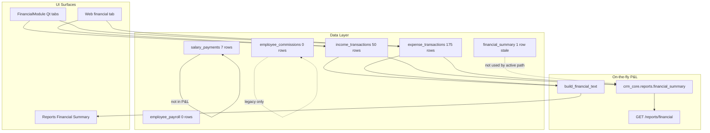

# SECTION 9: FINANCIAL WORKFLOWS
## Engineering Audit - Real Estate CRM System

**Date:** 2026-07-15  
**Depends on:** Sections 5–8 (Database, ER, UI Flow, Business Workflows)  
**Evidence:** Live `real_estate_crm.db`, [`CRM/modules/financial.py`](CRM/modules/financial.py), [`CRM/app_window.py`](CRM/app_window.py) (`income_spec`, `expense_spec`), [`CRM/modules/salary.py`](CRM/modules/salary.py), [`CRM/modules/report_helpers.py`](CRM/modules/report_helpers.py), [`crm_core/reports.py`](crm_core/reports.py), [`backend/models.py`](backend/models.py), [`backend/routers/reports_router.py`](backend/routers/reports_router.py), [`frontend/app.js`](frontend/app.js), legacy [`financial_module.py`](financial_module.py), [`employee_module.py`](employee_module.py), [`data_import_module.py`](data_import_module.py)

---

## 9.1 Analysis

### Current financial architecture

The CRM implements a **single-entry cash-oriented model**: two transaction lists (income and expense) plus a derived P&L summary. Payroll is a **separate silo**. There is no general ledger, no double-entry journal, and no automatic posting from deal close.

### Live database snapshot

| Table | Rows | Role in active app |
|-------|------|-------------------|
| `income_transactions` | 50 | Primary income register |
| `expense_transactions` | 175 | Primary expense register |
| `salary_payments` | 7 | HR payroll (Rs 232,000 net total) |
| `financial_summary` | 1 | Cached month rollup — **stale** |
| `employee_commissions` | 0 | Legacy schema; unused by Qt/API |
| `employee_payroll` | 0 | Legacy schema; unused by Qt/API |
| `employees` | 6 | `commission_rate` all **0.0** in live data |

**Computed P&L (all-time from transactions):** Income Rs 2,365,000 | Expense Rs 311,780 | Net Rs 2,053,220  
**Cached `financial_summary`:** Income Rs 2,365,000 | Expense Rs **284,320** | Net Rs 2,080,680 — expense total **out of date** by Rs 27,460.

### Column / schema drift (financial tables)

Live DB columns **not** in SQLAlchemy models or current UI forms:

| Column | `income_transactions` | `expense_transactions` | In ORM/UI? |
|--------|----------------------|--------------------------|------------|
| `property_id` | 50/50 rows populated | 55/175 populated | No in [`backend/models.py`](backend/models.py); no field in `income_spec`/`expense_spec` — populated via [`data_import_module.py`](data_import_module.py) |
| `department` | present | present | No |
| `status` | present | present | No |
| `recorded_by` | present | present | No |
| `approved_by` | — | present | No |

No FK from `property_id` → `properties.id` (Section 5 finding).

### Income / expense taxonomy mismatch

**UI combo options** (`income_spec` in [`CRM/app_window.py`](CRM/app_window.py)): Rent, Deposit, Maintenance, Commission, Utility, Advance, Other.

**Live DB `income_type` values:** `rental_income`, `deposit_returned`, `maintenance_charge`, `brokerage_commission`, `late_payment_charge` — legacy/import naming from [`financial_module.py`](financial_module.py) `record_income(default='rental_income')`.

**Expense categories:** [`crm_core/constants.py`](crm_core/constants.py) defines 22 canonical categories (e.g. `Commission`, `Petty Cash`). Live DB has **31 distinct** values with inconsistent casing (`commissions`, `legal`, `utilities` vs `Commission`, `Legal`, `Utilities`).

### Payment method (cash vs bank)

| Table | Cash | Other |
|-------|------|-------|
| `income_transactions` | 50 (100%) | — |
| `expense_transactions` | 172 | Online 1, blank 2 |
| `salary_payments` | 7 (100%) | — |

`payment_method` is captured but **not** used to maintain separate cash book and bank book balances.

---

## 9.2 Implemented financial flows

### A. Record income

1. User opens Financials → Income (desktop [`FinancialModule`](CRM/modules/financial.py) or web `financial` tab).  
2. `DataTablePage` / API creates row: date, type, amount, client, receipt no (auto `gen_id("RCP")`), payment method.  
3. No link to deal, archive, or property in current UI (though `property_id` may exist from imports).  
4. No automatic posting when availability is marked Rented/Sold (Section 8).

### B. Record expense

1. Same pattern with `expense_category`, vendor, invoice no (`gen_id("INV")`).  
2. Categories from settings/`EXPENSE_CATEGORIES` on desktop; web loads from API settings.  
3. `approved_by` column exists in DB but no approval workflow in financial UI.

### C. P&L summary

| Path | Implementation |
|------|----------------|
| Desktop Summary tab | [`SummaryPage`](CRM/modules/phase_one.py) → `build_financial_text()` |
| Reports menu | [`report_helpers.build_financial_text`](CRM/modules/report_helpers.py) |
| API | `GET /reports/financial` → [`crm_core.reports.financial_summary`](crm_core/reports.py) |
| Export | Text file to `OUTPUT_DIR/financial_summary.txt` |

Formula: `net_profit = SUM(income) - SUM(expense)` by optional date range. **Salary payments excluded.**

### D. Pay salary

[`SalaryPage.pay_salary`](CRM/modules/salary.py): inserts into `salary_payments` with base, bonus, deductions, net. Does **not** create offsetting `expense_transactions` row under "Salaries" — manual duplicate entry required for P&L accuracy.

### E. Commission (fragmented)

| Mechanism | Status |
|-----------|--------|
| `employees.commission_rate` | Field exists; all live rates 0% |
| `app_settings.default_commission` | Setting exists (Phase1 settings) |
| `income_type` = brokerage_commission | 5 manual income rows (Rs 75,000) |
| `expense_category` = commissions | 5 expense rows (Rs 50,000) |
| `employee_commissions` table | 0 rows; only [`employee_module.py`](employee_module.py) writes |
| Deal close → commission | **Not implemented** |

### F. Deal ↔ finance bridge

Closing a deal archives to `rented_properties` / `sold_properties` with `monthly_rent` / `demand` values but **does not** create income, receivable, or commission entries. Property sync updates `properties` inventory only.

---

## 9.3 Prompt accounting requirements vs implementation

| Prompt requirement | Implemented? | Evidence |
|--------------------|--------------|----------|
| Cash Book | Partial | All transactions are implicit cash book entries; no running balance, no drawer reconciliation |
| Bank Book | No | `payment_method` includes Bank Transfer/Online but no bank ledger or balance |
| Accounts Receivable | No | No AR table; no tenant installment balances |
| Accounts Payable | No | No AP / vendor liability tracking |
| General Ledger | No | No chart of accounts, no debit/credit pairs |
| Journal entries | No | — |
| Commission (accurate, configurable) | Partial | Manual income/expense lines; rate on employee unused; no deal link |
| Installments | No | Section 8 gap |
| Refunds / Adjustments | Partial | `deposit_returned` income type only; no adjustment journal |
| Reconciliation | No | No bank/cash reconcile UI or audit |
| Profit & Loss | Yes | `build_financial_text` + API `financial_summary` |
| Expense analysis | Yes | By category in summary |
| Cash flow | No | P&L only; no cash-flow statement |
| Pending payments report | No | No receivable aging |
| Property-level P&L | Partial | `property_id` in DB but not exposed in UI/reports |

---

## 9.4 Findings (ranked)

### Critical

| ID | Problem | Impact | Risk | Recommended solution | Complexity | Regression |
|----|---------|--------|------|----------------------|------------|------------|
| F-C1 | **No double-entry / ledger** — income and expense are independent lists | Cannot satisfy agency accounting audit; errors undetectable | Financial misstatement | Phase 5: optional `ledger_entries` with debit/credit accounts; keep existing tables as source | High | Med |
| F-C2 | **Deal close does not post money** — 15 rented + 1 sold archives with no linked receipts/commission | Closed deals invisible in books unless manually re-entered | Revenue leakage; commission disputes | Post-close wizard: receipt + commission draft rows keyed to archive id | High | Med |
| F-C3 | **No installments / receivables** for sale/rent deals | Cannot track token, booking, installment schedules | Cash collection failures | New `installment_schedules` + `installment_payments` linked to archive/deal | High | Med |
| F-C4 | **`property_id` populated but orphaned** (50 income, 55 expense) without FK or UI | Property P&L reports unreliable if FK invalid | Wrong owner statements | Validate orphans; add FK; expose property picker in financial forms | Med | Med |

### High

| ID | Problem | Impact | Risk | Recommended solution | Complexity | Regression |
|----|---------|--------|------|----------------------|------------|------------|
| F-H1 | **Salary outside P&L** — `salary_payments` Rs 232k not in expense summary | Understated expenses; double manual entry if also "Salaries" expense | Inflated profit | Option A: auto-post expense on pay salary; Option B: include payroll in `financial_summary` | Med | Med |
| F-H2 | **`financial_summary` cache stale** (284k vs 311k expenses) | Dashboard/month cache wrong if anything reads table | Bad management decisions | Deprecate table or refresh on transaction save; reports already compute live | Low | Low |
| F-H3 | **`employee_commissions` / `employee_payroll` dead** — legacy [`employee_module.py`](employee_module.py) only | Schema noise; false expectation of commission tracking | Dev confusion | Document deprecated; migrate to unified commission entity or remove after audit | Med | Low |
| F-H4 | **Income/expense type taxonomy split** — UI labels ≠ DB values (`Rent` vs `rental_income`) | Import/export/report grouping breaks | Miscategorized KPIs | Canonical enum + migration map; write-through on save | Med | Med |
| F-H5 | **No cash vs bank book separation** despite `payment_method` | Cannot reconcile bank statements | Audit failure | Sub-ledgers by payment_method or account_id column | Med | Med |
| F-H6 | **31 expense categories** vs 22 in `EXPENSE_CATEGORIES` | Inconsistent reporting buckets | P&L category drift | Normalize on save; admin category manager | Low–Med | Med |

### Medium

| ID | Problem | Impact | Risk | Recommended solution | Complexity | Regression |
|----|---------|--------|------|----------------------|------------|------------|
| F-M1 | Commission income (75k) and commission expense (50k) **not tied to employees or deals** | Cannot compute agent profitability | Payroll errors | Link commission rows to `employee_id` + `deal_id` | Med | Low |
| F-M2 | `employees.commission_rate` all 0% in production | Auto-calculation disabled | Manual commission only | Seed rates; use `default_commission` setting on close | Low | Low |
| F-M3 | Expense `approved_by` column unused in UI | No spend approval trail | Unauthorized expenses | Optional approval workflow for expenses over threshold | Med | Low |
| F-M4 | Legacy [`financial_module.py`](financial_module.py) parallel implementation | Maintenance burden | Divergent behavior if invoked | Mark deprecated; route all through `CRMServices` | Low | Low |
| F-M5 | No refund/adjustment workflow beyond `deposit_returned` income type | Adjustments as ad-hoc negative rows | Audit gaps | Formal adjustment transaction type with reason | Med | Low |

### Low

| ID | Problem | Impact | Risk | Recommended solution | Complexity | Regression |
|----|---------|--------|------|----------------------|------------|------------|
| F-L1 | Auto receipt/invoice numbers (`gen_id`) | Good UX | — | Keep; extend to commission vouchers | Low | None |
| F-L2 | Desktop/web financial field parity | Consistent entry | — | Already aligned on core fields | — | None |
| F-L3 | `GET /reports/financial` with date filters | API consumers supported | — | Document in Phase 10 | Low | None |

---

## 9.5 Recommendations

1. **Do not replace** `income_transactions` / `expense_transactions` — they work for agency petty-cash style ops; extend them.  
2. **First financial fix (Phase 6):** normalize income/expense enums; include or auto-post payroll in P&L; deprecate stale `financial_summary` cache.  
3. **Phase 5 money graph:** installments + deal-linked commission posting on archive close (extends Section 8 B-C2).  
4. **Phase 5 ledger (optional tier):** add `ledger_entries` for agencies needing full books; keep simple mode for small offices.  
5. Expose `property_id` in financial UI once FK validated — enables property-level P&L without new tables.  
6. Retire or clearly fence [`employee_module.py`](employee_module.py) / [`financial_module.py`](financial_module.py) commission paths.

---

## 9.6 Engineering rationale

- Prompt accounting review targets **financial correctness** for multi-agency scale. Current design optimizes **fast data entry** (lists + summary), which is valid for small agencies but hits limits at installments, commission splits, and reconciliation.  
- Live data proves the summary path is used (50 income, 175 expense rows) — preserve it.  
- Stale `financial_summary` and taxonomy drift are **fixable without architecture rewrite** (high ROI).  
- Missing installments/ledger are **domain gaps**, consistent with Sections 5 and 8.

---

## 9.7 Implementation plan (future phases — not executed now)

| Priority | Phase | Action |
|----------|-------|--------|
| P0 | 6 | Normalize income_type / expense_category on write; category admin |
| P0 | 6 | P&L includes payroll OR auto-expense on `pay_salary` |
| P1 | 5 | Post-close commission + receipt drafts from archive |
| P1 | 5 | Installment schedule + payment tracking |
| P2 | 5 | Cash/bank sub-ledger by `payment_method` or `account_id` |
| P2 | 4 | FK `property_id` → `properties`; orphan cleanup |
| P3 | 5 | Optional double-entry ledger for enterprise tier |
| P3 | 10 | Document `GET /reports/financial` and P&L limits |

---

## 9.8 Code changes

**None.** Audit-only (Phase 2).

---

## 9.9 Validation results

| Check | Result |
|-------|--------|
| `income_transactions` count | 50 |
| `expense_transactions` count | 175 |
| `salary_payments` count / total net | 7 / Rs 232,000 |
| `employee_commissions` usage | 0 rows; legacy module only |
| P&L formula | `build_financial_text` + `crm_core.reports.financial_summary` — income minus expense |
| Payroll in P&L | **Excluded** |
| API financial endpoint | `GET /reports/financial` confirmed |
| Desktop financial UI | Income / Expenses / Summary tabs confirmed |
| `financial_summary` cache vs live | **Stale** (expense mismatch) |
| Deal close → finance | **No automatic posting** |

---

## 9.10 Next proposed phase step

**Section 10: Security Model** — authentication (SHA-256), authorization/roles, audit trails, session management, backup strategy (depends on Section 1 architecture).
